# Lab 01: Set-up

This is a new version of Lab01 with updated instructions due to software changes. The old version can be found [Here](../lab01Old) 

The aim of this lab is to set-up our development environment for the module.  There are a number of tools we are using in the module and we will set most of them up today.  The systems we will be using are:

- Java
- IntelliJ
- Maven
- Git and GitHub
- Docker 

You can use your own laptop for the module or the machines in D02. The instructions here are mainly for D02 but are easily adapted.

## Behavioural Objectives

After this lab you will be able to:

- **Setup** a *development environment in IntelliJ.*

- **Setup** a *GitHub repository.*

- **Pull** a *Docker container.*

- **Manage** a *Docker container using basic commands.*

- **Define** a *Dockerfile to create your own container.*

- **Deploy** to a *Docker container from IntelliJ.*

## Create a Github repository  

There are different ways to create a new git repository. You could (but don't) open a command prompt inside any folder (and enter the command 

  ```bash
  git init
  ```

However the following method saves time integrating our local repository (Git) with our distributed (online) GitHub repository so the following way is easier

Create a GitHub account. I suggest using your Uni email but you can use your own.

Create a new Repository

  

Name the Repo Whatever you like and a README file to it. Add a license as well (not shown here as I forgot but it is used in Lab 2)

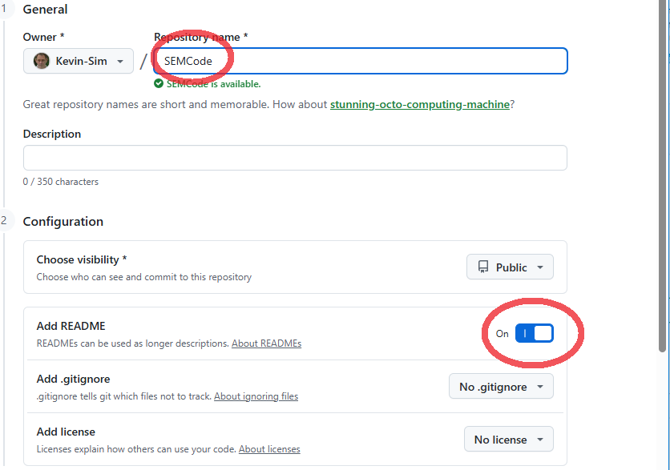

  

If you need to add a licence later see https://docs.github.com/en/communities/setting-up-your-project-for-healthy-contributions/adding-a-license-to-a-repository

Now copy the GitHub URL

  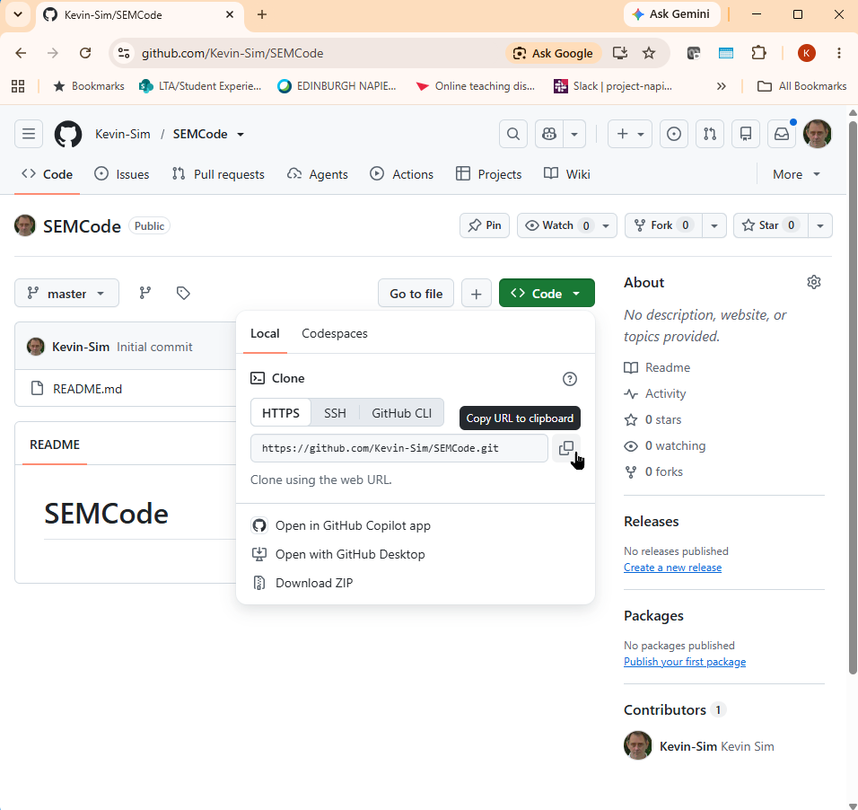

Open a command prompt anywhere on your PC or if Using a University PC in D02 in C:\Users\40000xxxx (your matric number) 

  Use the command git clone <URL> to clone your Repository from GitHub

  ```bash
  git clone https://path
  ```

  

  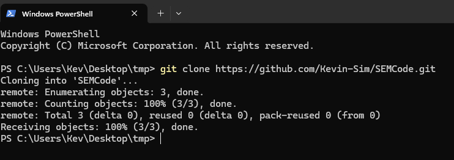

  

## IntelliJ Setup

IntelliJ, Docker and Git can be downloaded to your own machine using the links below. If you are using the machines in D02 they are *mostly* installed

**IntelliJ IDEA available @ https://www.jetbrains.com/idea/**

**Docker desktop available @ https://www.docker.com/products/docker-desktop  (see below re Docker 4.44.1)**

**Git @ ** https://git-scm.com/install/windows

Note that I ran into issues at home after trying the latest version of IntelliJ with Java 25 and the latest version of Docker. I am therefore writing this for Java 17 and Docker [4.44.1](https://docs.docker.com/desktop/release-notes/#4441)

IntelliJ IDEA is the Integrated Development Environment that we will be using on the module. You can download IntelliJ IDEA from https://www.jetbrains.com/idea/ The community edition of IntelliJ IDEA is sufficient for this module but you can if you wish get access to the ultimate edition by signing up for a student licence at [https://www.jetbrains.com/shop/eform/students](https://www.jetbrains.com/shop/eform/students)

## Open IntelliJ

Create a new project in the folder where you cloned your repository. This needs to be stored on the C:\ drive in D02 as intellij can't deal with network drives anymore (I have been told it works with OneDrive)

You will have a directory in D02 in C:\Users\40000xxxx (your matric number) where your repo should be cloned to 

Give the project the same name as you used for the GitHub repo as shown below. I have named it SEMCode

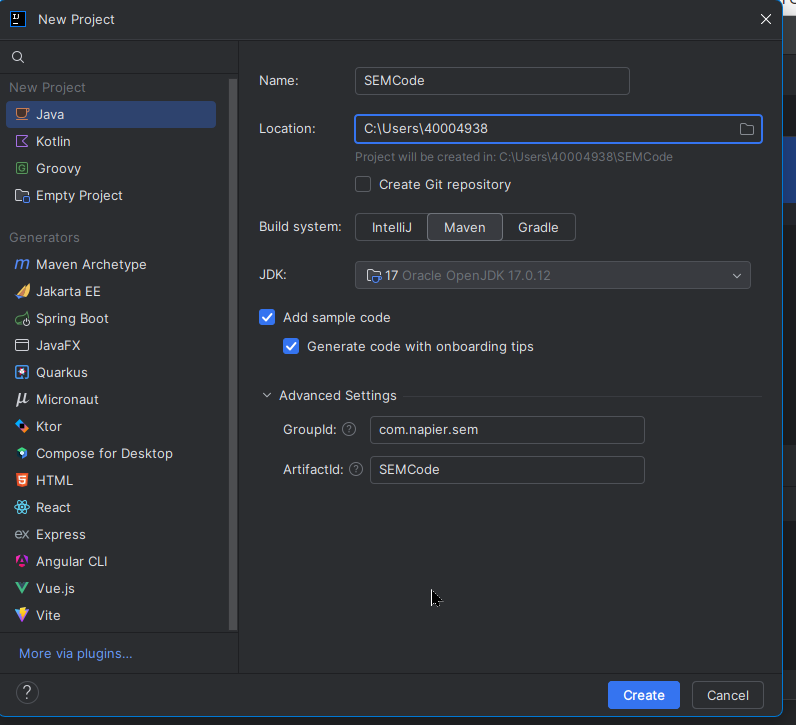


You will be presented with the following 

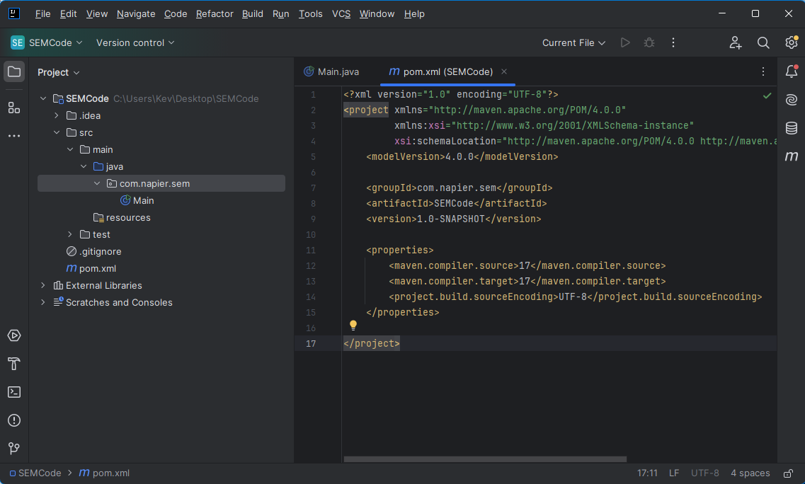

The main window shows the maven setup file (pom.xml)

On the left we can see the project structure.

- The .idea folder contains IntelliJ setup files which we are not interested in. 
- The src folder contains our Java Code. There is one automatically generated class Main inside a package named com.napier.sem
- The test folder will eventually be used for our test code. 
- The .gitigore file will be used by git to tell it which files to ignore. We only want code and not setup files and binary files such as compiled classes in git and GitHub
- The pom.xml file is our Maven Setup file

**Open the Java Code and you should be able to run it using the green arrows**

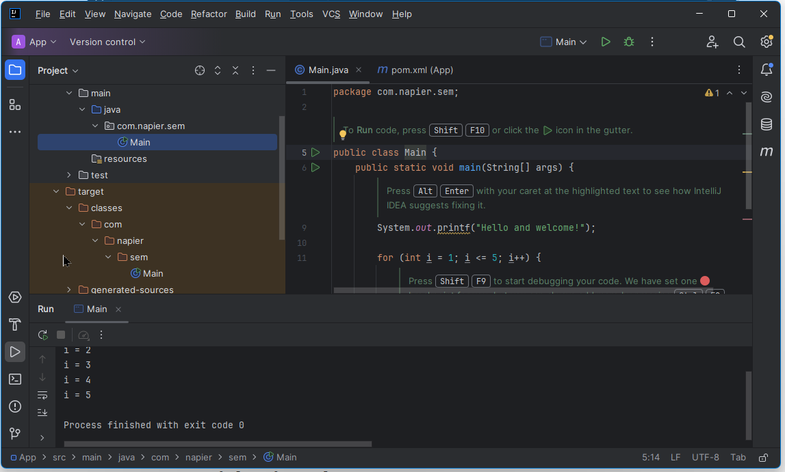


IntelliJ compiles the code to the target/classes folder that has now appeared on the left hand side in a folder structure the same as the package name of the source code files

 Lets ignore some stuff

  Open the .gitignore file and replace everything with the following

```
  target/
  .mvn/
  .idea/
  
```

Open a terminal (3rd button from bottom left) and type the following commands

```bash
git add .
git commit -m "my first commit"
git push
```

The first time you do this a pop up should appear asking you to verify your account. Select verify with browser then click Authenticate in the GitHub page that appears

The console output should show that the three commands were successful and the repository should have updated on GitHub

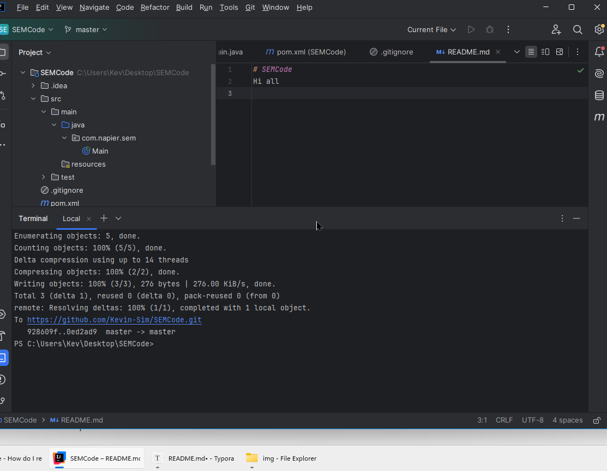


Go back to GitHub and refresh the page

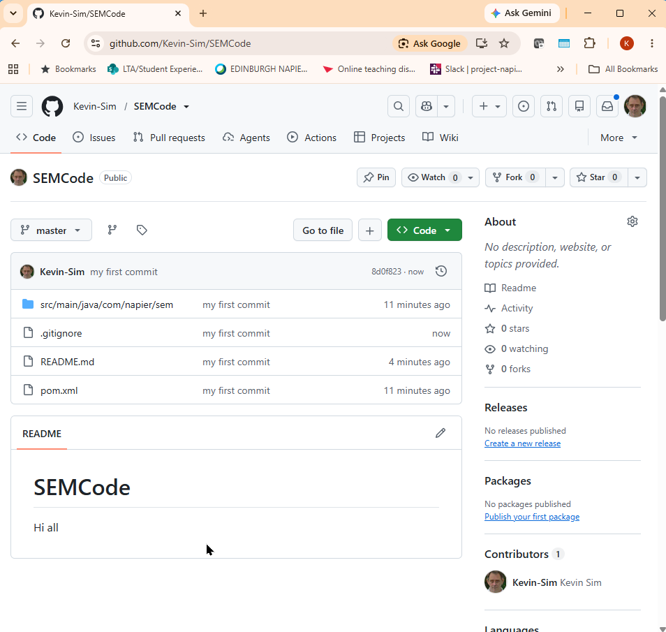

We are now synced

If you are using the University machines next week your code will be gone!!!!!

But it's all backed up on GitHub

**Always remember to add commit and push frequently **


## Start Docker Desktop

You may get a pop up command prompt saying WSL (Windows Subsystem for Linux) needs installed) If so press any key to continue. If Docker still doesn't start try again.

Oncer Docker is Running you should see


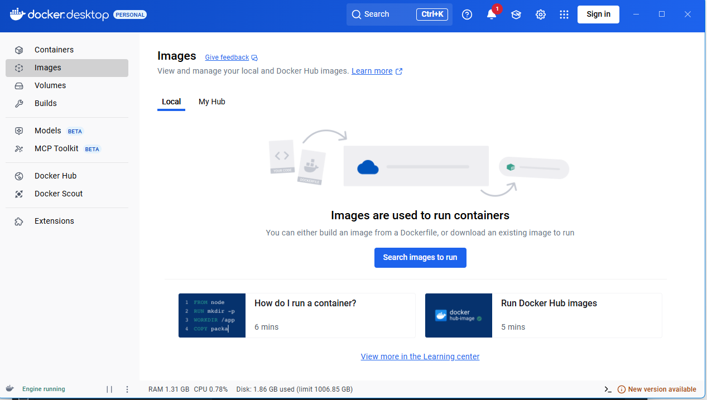


Go back to IntelliJ, open the service tab (bottom left) and double click the Docker Icon to Connect. You should see the following in the service window at the bottom.

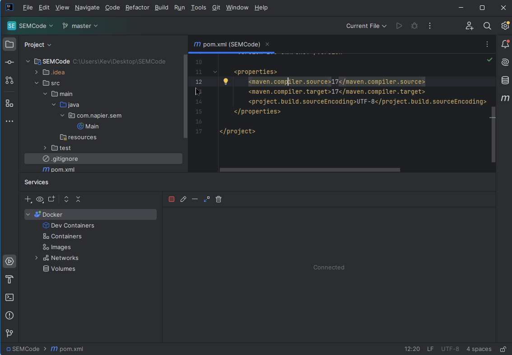


### Basic Docker Usage

We can pull docker images, build containers and run them from the command line. Most of the time we won't do that but here's a quick example

Docker and containers are covered in [Lecture 05](https://github.com/Kevin-Sim/SET08103/blob/master/lectures/lecture05). Here we are looking at the basic commands to get us started.

Docker works by providing application containers. Several container images already exist for our use: go to [Docker Hub](https://hub.docker.com/) and search to see the available options. This means we can launch applications easily via Docker, including infrastructure services like web servers and databases.

#### Pulling Docker Images

#

To get started, let us pull a web server. Nginx is a common lightweight web server that will illustrate the basic steps. First, we must `pull` a Docker image from the server to our local repository (machine):

From a command prompt 

```
docker pull nginx
```

This will pull `nginx` image, which allows us to instantiate (run) it locally as a container. We can also specify which version of Nginx we want by adding a *tag*:

```
docker pull nginx:latest
```

This will pull the latest Nginx version image, which is the default behaviour of `pull`. See the Nginx image page on [Docker Hub](https://hub.docker.com/_/nginx/) for more details.

#### Starting Docker Containers

Once we have an image in our local repository, we can start it as a container. To do this we use the `run` command:

```
docker run nginx
```

You will notice that nothing happened, and the command line is waiting. Using `run` in this way is not recommended. Press **Ctrl-C** to stop the running container.

Docker containers should be started as detached processes. We do this using the `-d` flag. Furthermore, for Nginx we need to open up a port for the web server. We do this using the `-p` flag. Let us try again and use these new flags:

```
docker run -d -p 8080:80 nginx
```

We have run the Nginx server as a detached container, and mapped the local machine's port 8080 to the port 80 of the Nginx web server. If you don't know, port 80 is the default port a web server operates on. When you issue this command you will get a hash code value out. Mine was:

```
c147e0b0386f50bc62c39ddeb422633aae6104093f28aa1bfc98fc18243c860b
```

But is a web server running? We can test that by opening up a web browser and going to http://localhost:8080/

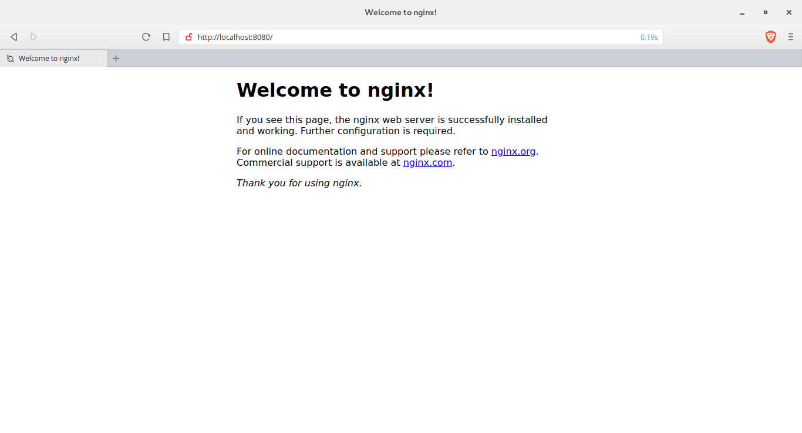

If you see the Nginx welcome screen congratulations! You are up and running with your first container.


#### Stopping Containers

It is easy to forget which containers are running on your system. To check, use the following command:

```
docker ps
```

You will get an output similar to the following:

```
CONTAINER ID   IMAGE     COMMAND                  CREATED          STATUS          
0e6095404806   nginx     "/docker-entrypoint.…"   10 minutes ago   Up 10 minutes   
PORTS                                     NAMES
0.0.0.0:8080->80/tcp, [::]:8080->80/tcp   kind_perlman 
```

There is quite a bit of information here, but what we are interested in is the `CONTAINER ID` (`0e6095404806 `) and the `NAMES` (`kind_perlman`). These will be different for you. Either of these identifiers we can use to stop the container. We do so with the `stop` command:

```
docker stop 0e6095404806
```

Executing `docker ps` again will now provide empty output:

```
CONTAINER ID        IMAGE               COMMAND                  CREATED             STATUS              PORTS
```


And you can test that the web server is stopped by going to `localhost:8080` although you might have to hit refresh to ensure the cached version is not used.

#### Removing Containers

Although the container has stopped it has not been removed from your system. To list containers on the local system run `ps` with the `-a` flag:

```
docker ps -a
```

You will get output similar to the following.

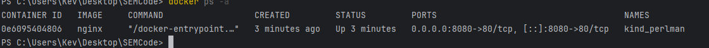

To remove a container we use the `rm` command with the name or container ID:

```
docker rm kind_perlman 
```

If you want a container to be automatically removed when stopped, we can use the `--rm` flag when starting a container:

```
docker run -d --rm -p 8080:80 nginx
```

When `stop` is called on this container it will be automatically removed from the local system.

#### Docker Commands Covered

Below are the Docker commands we have covered so far.

| Docker Command                                | Description                                                  |
| --------------------------------------------- | ------------------------------------------------------------ |
| `docker pull <name>`                          | *Pulls the named Docker image from the server to the local repository allowing it to be instantiated.* |
| `docker run <name>`                           | *Starts running an instance of the image `name` as a container.* |
| `docker run -d <name>`                        | *Starts running an instance of the image `name` as a detached container.* |
| `docker run -d -p <local>:<container> <name>` | *Starts a container, mapping the local port `local` to the container port `container`*. |
| `docker run -d --rm <name>`                   | *Starts running an instance of `name` which will be automatically removed when the container is stopped.* |
| `docker ps`                                   | *Lists running containers.*                                  |
| `docker ps -a`                                | *Lists all containers.*                                      |
| `docker stop <id>`                            | *Stops the container with the given `id` which is the `CONTAINER ID` or `NAME`.* |
| `docker rm <id>`                              | *Removes a container from the local system.*                 |

### Writing Dockerfiles

We will usually do this from IntelliJ but again knowing the command line method is usefull

Our aim with Docker is to run our applications within containers.  To do this, we need to create our own Docker images, which we do by writing a **Dockerfile**.  A Dockerfile specifies the set-up for a image which we can create containers from, and the syntax is simple.  Writing Dockerfiles falls into *infrastructure as code* since we can define our execution infrastructure in code files (Dockerfiles).

To start, create a new folder called `test-dockerfile` in the file-system and open the terminal (Powershell, command prompt) in that folder.  Now create a file called `Dockerfile` and use the following:

```docker
FROM ubuntu:latest
CMD ["echo", "'It worked!'"]
```

We have defined two items for our Docker image:

1. It uses the latest Ubuntu image as its parent (base).  This is the `FROM` statement.
2. It executes `echo 'It worked!'` whenever the container is started.  This is the `CMD` statement.

To build our image we use the following (from the directory that `Dockerfile` is saved):

```shell
docker build -t test-dockerfile .
```

The command tells docker to *build* an image (`build`), with the name `test-dockerfile` (`-t` means we are providing a name), and to use the current directory (`.`).  So the command format is:

```shell
docker build -t <name> <folder>
```

When executed you will get the following output:

```shell
Sending build context to Docker daemon  2.048kB
Step 1/2 : FROM ubuntu:latest
latest: Pulling from library/ubuntu
6b98dfc16071: Pull complete
4001a1209541: Pull complete
6319fc68c576: Pull complete
b24603670dc3: Pull complete
97f170c87c6f: Pull complete
Digest: sha256:5f4bdc3467537cbbe563e80db2c3ec95d548a9145d64453b06939c4592d67b6d
Status: Downloaded newer image for ubuntu:latest
 ---> 113a43faa138
Step 2/2 : CMD ["echo", "It worked!"]
 ---> Running in 3fcfdc028360
Removing intermediate container 3fcfdc028360
 ---> 4482338d49b4
Successfully built 4482338d49b4
Successfully tagged test-dockerfile:latest
```

OK, let us run an instance of our image.

```shell
docker run --rm test-dockerfile
```

And you should have the received the following output:

```shell
It worked!
```

If so, congratulations!  You have created and run your first personal Docker image.  We will look at further Dockerfile commands as we need them.  Let us get back to IntelliJ.

## Docker in IntelliJ

Create a Dockerfile in the root of your project


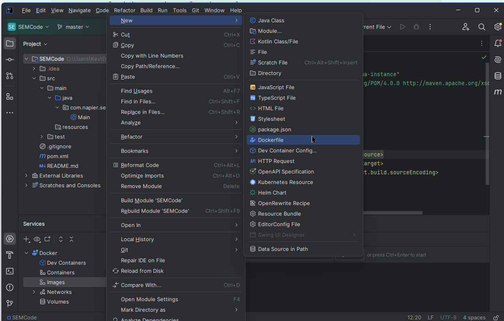


Add the following

```bash
FROM amazoncorretto:17
COPY ./target/classes/com /tmp/com
WORKDIR /tmp
ENTRYPOINT ["java", "com.napier.sem.Main"]
```

If you used Java 25 change the first line

When run this will

- Pull a Linux image with Java 17 installed
- Copy our compiled files from our project to the docker containers tmp directory
- Change to the tmp directory in the container
- Run the command `java com.napier.sem.Main`

We can run the Dockerfile using the green arrow


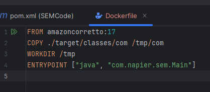


If successful you should get a console output like

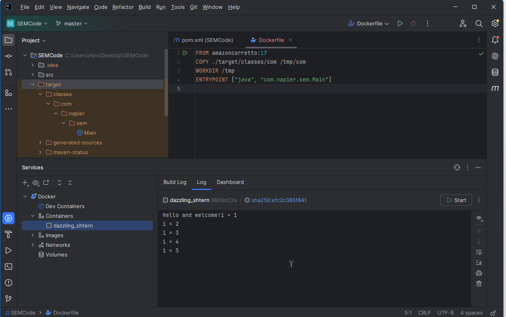


**Update your GitHub repository**

1. Add files to the commit.

2. Create the commit.

3. Push the commit.

```bash
   git add .
   git commit -m "Added Dockerfile"
   git push
```

And you are done. A lot of workfor a HelloWorld App but we are in a good position to carry on in the next lab. And just one final check for those of you who are interested. Our created image exists in our local repository. You can check this by using the `docker images` command:

```
docker images
```


You will get an output as follows:

```
REPOSITORY   TAG       IMAGE ID       CREATED         SIZE
<none>       <none>    efc2c385f841   6 minutes ago   693MB
```

The one shown is the one IntelliJ just created. We can create a new instance by using the `IMAGE ID`. For example, if I run:

```
docker run --rm efc2c385f841
```


I get the output:

```
PS C:\Users\Kev\Desktop\SEMCode> docker run --rm efc2c385f841
Hello and welcome!i = 1
i = 2
i = 3
i = 4
i = 5
PS C:\Users\Kev\Desktop\SEMCode> 
```
We can share this image on Dockerhub (or via private Docker repositories) so others can run our application easily.

There is lots we can do here.

Pull a linux image
Install some packages such as python and required libraries
Save the Image and Share on DockerHub
Use as a base for python projects

There is a lot to take in here. Play with it and try a few times

Give yourself a badge (we will be using these later)

Go to https://shields.io/badges/git-hub-commit-activity-branch

Fill in your repo details

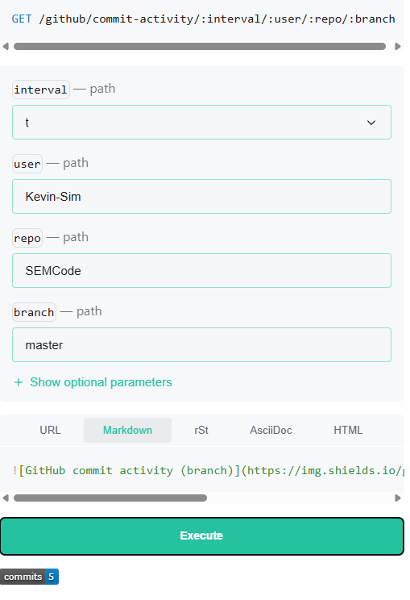


Copy paste markdown code into your README file


The code generated while making these lab notes is at https://github.com/Kevin-Sim/SEMCode

