# Lab 01: Set-up

The aim of this lab is to set-up our development environment for the module.  There are a number of tools we are using in the module and we will set most of them up today.  The systems we will be using are:

- Java
- IntelliJ
- Maven
- Git and GitHub
- Docker

These provide a modern software development and delivery environment.  These tools will underpin the assessment for the module so getting everything set-up correctly is key.

## Behavioural Objectives

After this lab you will be able to:

- **Setup** a *development environment in IntelliJ.*
- **Setup** a *GitHub repository.*
- **Pull** a *Docker container.*
- **Manage** a *Docker container using basic commands.*
- **Define** a *Dockerfile to create your own container.*
- **Deploy** to a *Docker container from IntelliJ.*

## IntelliJ Setup

IntelliJ IDEA is the Integrated Development Environment that we will be using on the module. You can download IntelliJ IDEA from https://www.jetbrains.com/idea/ The community edition of IntelliJ IDEA is sufficient for this module but you can if you wish get access to the ultimate edition by signing up for a student licence at [https://www.jetbrains.com/shop/eform/students](https://www.jetbrains.com/shop/eform/students)

You will require Java and IntelliJ installed on the machine you plan to work on.  Once ready, start-up IntelliJ.  You should be presented with the following screen: Please note that this software changes regularly and if the screenshots look slightly different it's because I can't keep up. It should be similar and if you encounter any problems please let me know.


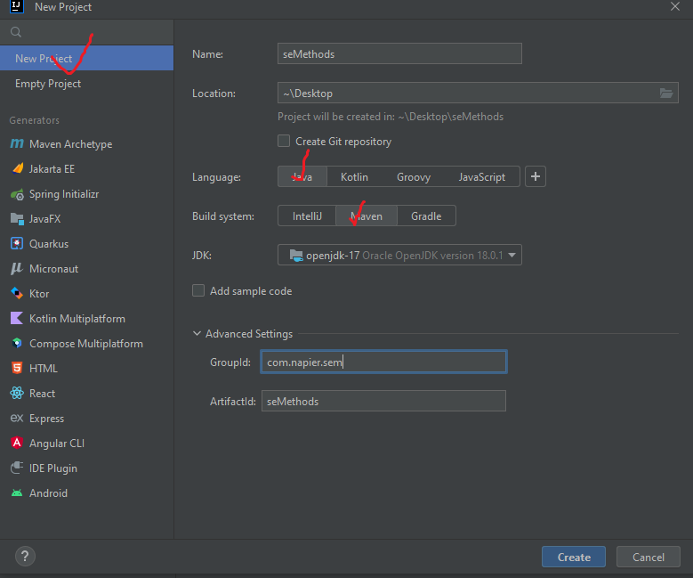


*Replicate the same settings as shown in the image (you can change the location).*  You need to do the following:

1. Select at most 17 as the JDK for the project. The Open JDK Docker image which we will be using use version 17 and you will get errors if you choose a higher version. 
2. Select **Maven** as the build system


Click **Finish** for your new project to be created.  This should open up the following window:

Change the Java compliance to at most 11 (below shows Java 10 on lines 11 & 12)

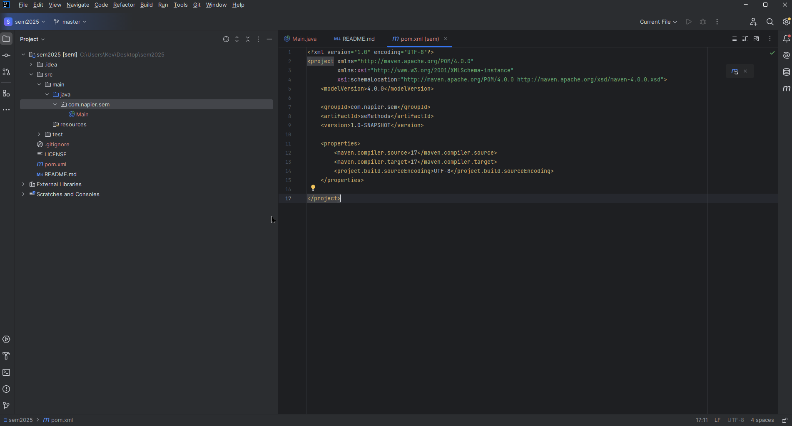

If you do not have this window then try the instructions again and if you still have a problem ask for help at the academic sessions. Please note that in the above screenshot version 11 should be the maximum for maven compiler source and target.

## Git with IntelliJ

Our next step is to set-up [version control](https://en.wikipedia.org/wiki/Version_control) for our project.  We will be using [Git](https://git-scm.com/) ([Wikipedia Entry](https://en.wikipedia.org/wiki/Git)).  Git is becoming the standard version control approach in software development, so you should see this as an opportunity to learn Git.  The module does not specifically cover the mechanics of Git.  There is a dedicated [website](https://try.github.io/) for Git learning resources.  This module will focus on using Git and version control correctly to deliver software.

IntelliJ has version control built in.  Therefore we can use version control from within our development environment.  This is also becoming the standard in software development.

To setup Git version control in IntelliJ undertake the following steps:

1. In the *main menu*, select **VCS** and then **Enable VCS Integration...**.  This will open the following window:


2. In this window, select **Git** in the drop-down selection box, and click **OK**.

A little notification should appear at the bottom of the window confirming that Git has been initialised for the project.

Our next step is to add a `.gitignore` file.  This file tells Git which type of files to ignore.  This is important in software development as compilers and build systems add numerous temporary files and output files that we do not need to track.

To add a `.gitignore` file just add a new file to the project.  To do so, either use the main menu (**File** then **New** then **File**) or **right-click** on the project and select **New** then **File**.  Call the file `.gitignore` and save.  Yes, include the dot in front of the name.  Ensure the name is correct.  Git will only recognise the file with that exact name in the main folder of the repository.

Once the file is created, you need to add the Java specific files to be ignored by Git.  This can be found [here](https://github.com/github/gitignore/blob/master/Java.gitignore) or below:

```shell
# Compiled class file
*.class

# Log file
*.log

# BlueJ files
*.ctxt

# Mobile Tools for Java (J2ME)
.mtj.tmp/

# Package Files #
*.jar
*.war
*.nar
*.ear
*.zip
*.tar.gz
*.rar

# virtual machine crash logs, see http://www.java.com/en/download/help/error_hotspot.xml
hs_err_pid*
```

You will also need the Maven specific values from [here](https://github.com/github/gitignore/blob/master/Maven.gitignore) or below:

```shell
target/
pom.xml.tag
pom.xml.releaseBackup
pom.xml.versionsBackup
pom.xml.next
release.properties
dependency-reduced-pom.xml
buildNumber.properties
.mvn/timing.properties
.mvn/wrapper/maven-wrapper.jar
```

Finally, at the end of the `.gitignore` file add the following line:

```shell
.idea/
```

This last line will tell Git to ignore the files generated by IntelliJ which are created in the .idea folder.

With these in the `.gitignore` file we can add it to version control.  To do this, **right-click** on the *.gitignore* file in IntelliJ, then select **Git** then **Add**.  This will add the file ready for our first commit.

We will also add another new file: `README.md`.  This file is the readme for the project, and is written in [Markdown](https://en.wikipedia.org/wiki/Markdown).  You will be using Markdown a lot in the module for documentation.  A [tutorial](https://www.markdowntutorial.com/) is available.

So to finish this stage of our set-up perform the following actions:

1. Add a new file - `README.md` to the root directory of the project.
2. Add some text to the readme - keep it simple at the moment.
3. Add `README.md` to Git (**right-click** the file, **Git** then **Add**).

## Getting Started with GitHub

The whole point of version control is to maintain your code somewhere backed-up and shareable with your team.  We will use *GitHub* as a repository for this module.  First, you will need to create an account on GitHub if you haven't already.  Go to [GitHub](https://github.com/) and **Sign Up**.  Two things to note:

1. You do not need a paid for account.
2. If you are a student, GitHub will give you [unlimited private repositories](https://education.github.com/pack).

New projects are started by default on a branch called *main* but IntelliJ uses *master* by default. To change GitHub's default branch name go to [https://github.com/settings/repositories](https://github.com/settings/repositories) and change the default to *master*

Now we can create a new repository. In GitHub, you will see a **+** near the top of the page, which you can select **New repository** from:

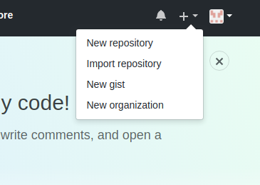

This will open a new window.  You need to enter the name for the repository (`devops`), make sure the repository is **Public** and then select the **Apache 2.0** license type.  **Ensure that no README is added or `.gitignore`**.  You have one already.  This details are illustrated below:

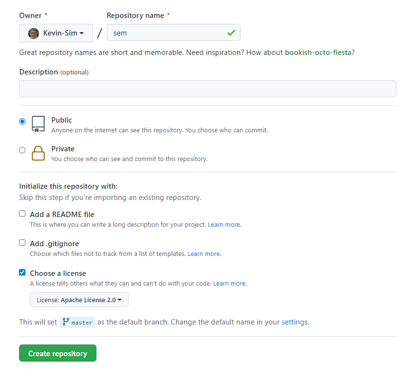

Click on **Create repository** and you will be presented with the following:

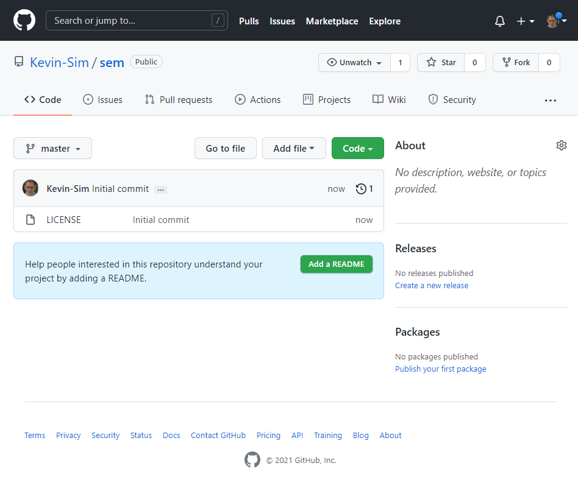

Now we need to tell IntelliJ the location of our repository.  This is the URL of the repository you created, which should be of the form `https://github.com/<user-name>/devops`.  For example, my repository covering the basics of this lab is [https://github.com/Kevin-Sim/DevOpsLabs](https://github.com/Kevin-Sim/DevOpsLabs)

To add the location to IntelliJ, select the  **Git** menu then and **Manage Remotes** to open the following window:


Click on the **+** button to open the **Define Remote** window, where the name **origin** should already defined.  `origin` is the standard remote name for the main origin of the code project.  Whenever you clone repositories this is the name used by default in the clone.  Add the URL of your repository into the URL text-box and click **OK**.

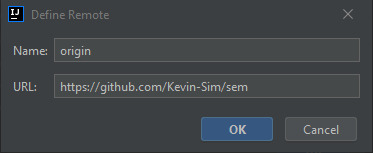

IntelliJ will test if the URL is valid, and when successful click **OK** to go back to IntelliJ's main screen.

To sync the remote repository select Fetch from the Git menu


We are now ready to pull the GitHub version of the repository to the local machine, which will add the license file from GitHub to our local machine.  To pull, select **Git** then **Pull**:


Check the `origin/master` branch, and click **Pull**.  The `LICENSE` file should appear in your project - although it might take a minute.  You can go into the file-system to check if you are impatient.

Let us now add the rest of our files ready to `commit` to GitHub.  Select **Git** then **Add**.  This will add all the qualifying files to our commit.  They are sitting in the *staging* area.  We look at version control in more detail in [Lecture 03](../../lectures/lecture03).

To create our commit, select **Git**then **Commit** to open the **Commit Changes** window:

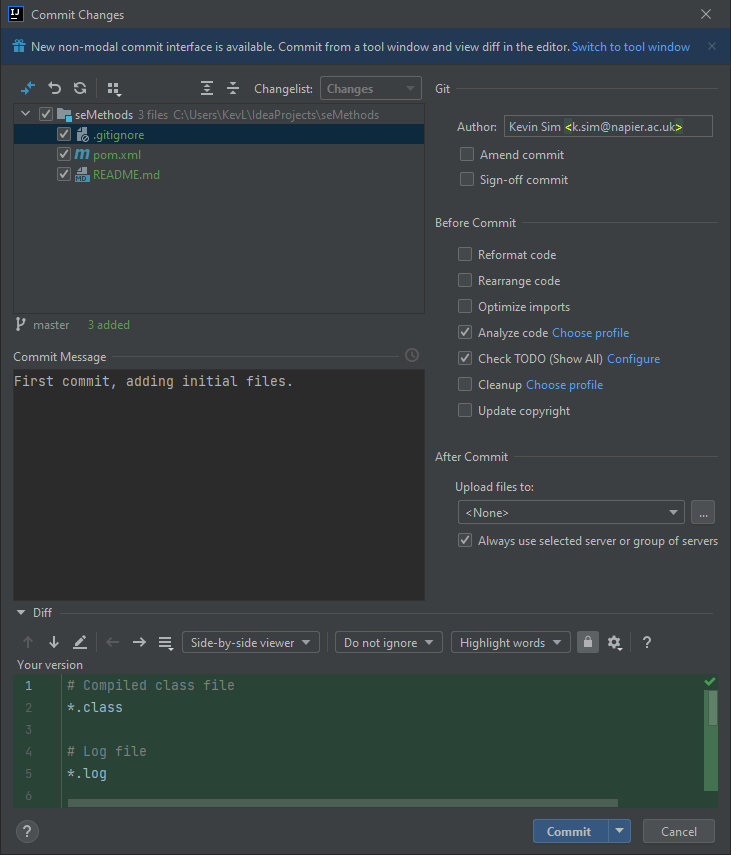

Ensure you add your name and email address in the **Author** text-box.  The image provides an example.  This should match the name and email address you are using in GitHub.

Your commits always need a message.  Set the **Commit Message** text-box to `First commit, adding initial files.`  Then press **Commit**.

We have now created a checkpoint in our code that we can **always** return to.  This is the power of version control.  We are check-pointing our code so we can rewind to previous versions.  As long as you commit often, you can always revert back to a previous version.

Our commit only exists on the local machine at the moment.  To send it to GitHub we have to `push` the commit to the remote.  To do this, select **Git** and **Push** to open the **Push Commits** window:

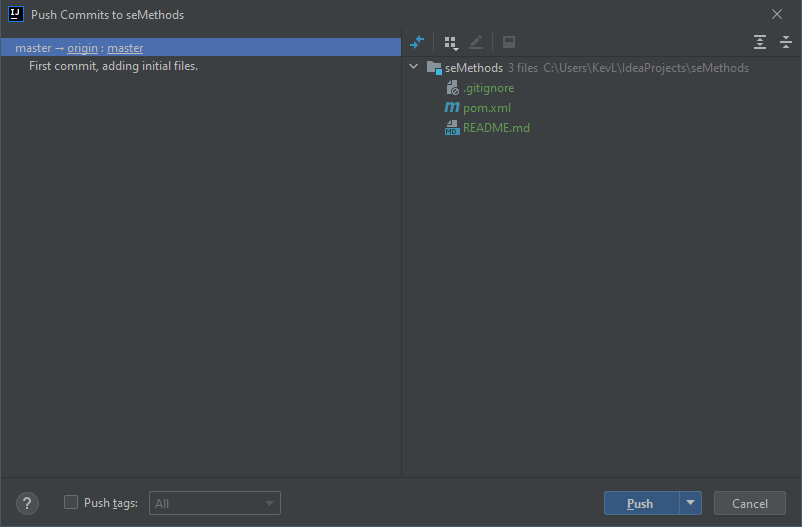

Click **Push** and refresh the GitHub page.  You should see your files there:

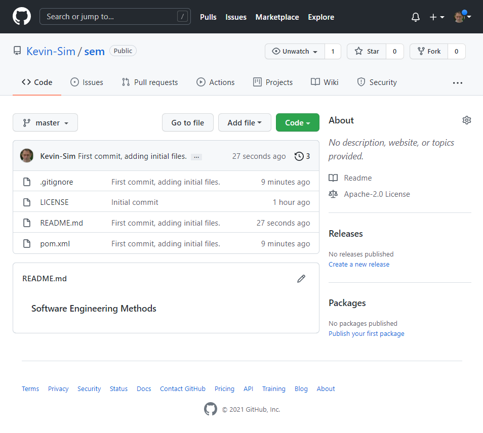

## Hello World Sanity Check

We have done quite a bit so far, but we have yet to write any actual code.  The module focuses on software engineering and methods rather than programming, but it is worth testing things are working.  Let us build a simple *Hello World* example.

In IntelliJ, **right-click** on the folder **devops->src->main->java** and select **New** then **Package** to open the **New Package** window:

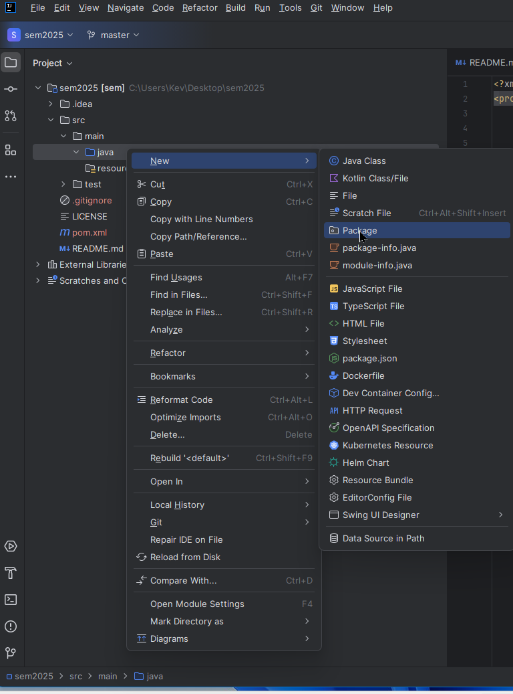

Call the package `com.napier.devops` and click **OK**.  Your **Project Structure** in IntelliJ should now look as follows:


Now **right-click** on **com.napier.devops** and select **New** and **Class** to open the **New Class** window:


Call the class **App** and click **OK**.  IntelliJ will helpfully ask if you want to add the file to your Git repository.  Select **Yes**.


We will use the following code:

```java
package com.napier.devops;

public class App
{
    public static void main(String[] args)
    {
        System.out.println("Boo yah!");
    }
}
```

Now select **Build** from the main menu, and then **Build Project**.  If all goes to plan your project will build successfully and we can run it.  Select **Run** then **Run**.  Select **App** as the target, and you should get the output at the bottom of the screen:

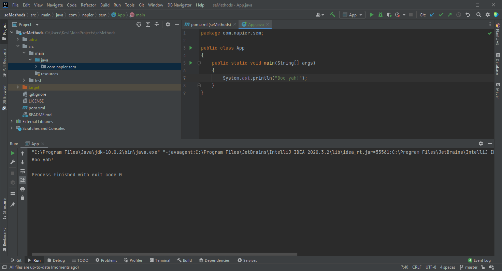

We now know that everything is working so far.  So let us commit the changes.  The steps to follow:

1. Open the Commit dialogue  **Git** then **Commit**.
2. Add the new file to the staging area by selecting it under unversioned files.
3. Make sure the author is updated, and add a suitable commit message before clicking **Commit**.

   

3. Push the changes to GitHub -  **Git**, then **Push**.  Click **Push** in the **Push Commit** window.

**Get used to this process - it will save your code from disaster!**.  We have again created a checkpoint where we know our code is working and doing what we expect.  Whenever you do a change - and make your changes small - and tested the build works, commit and push.  I will remind you a few more times, but this is a habit for you to form.

## Getting Started with Docker

We will step away from IntelliJ for a while to use Docker.  Docker will support our deployment to ensure we run in the same configuration wherever we execute our code.  This ensures we do not have conflicts between what works on our development machine and the deployment machine.

### Checking if Docker is Installed and Working

The simplest method to check if Docker is installed on your system is to open a terminal (or Powershell in Windows) and issue the following command:

```shell
docker --version
```

If installed you will get a response as follows:

```shell
Docker version 18.05.0-ce, build f150324782
```

To check if Docker is working correctly use the following command:

```shell
docker run hello-world
```

If Docker is working correctly you should get the following output:

```shell
Unable to find image 'hello-world:latest' locally
latest: Pulling from library/hello-world
9db2ca6ccae0: Pull complete
Digest: sha256:4b8ff392a12ed9ea17784bd3c9a8b1fa3299cac44aca35a85c90c5e3c7afacdc
Status: Downloaded newer image for hello-world:latest

Hello from Docker!
This message shows that your installation appears to be working correctly.

To generate this message, Docker took the following steps:
 1. The Docker client contacted the Docker daemon.
 2. The Docker daemon pulled the "hello-world" image from the Docker Hub.
    (amd64)
 3. The Docker daemon created a new container from that image which runs the
    executable that produces the output you are currently reading.
 4. The Docker daemon streamed that output to the Docker client, which sent it
    to your terminal.

To try something more ambitious, you can run an Ubuntu container with:
 $ docker run -it ubuntu bash

Share images, automate workflows, and more with a free Docker ID:
 https://hub.docker.com/

For more examples and ideas, visit:
 https://docs.docker.com/engine/userguide/

```

The output explains what Docker actually did when you issued the command.  We will cover aspects of these steps in the following sections.

If Docker is installed and working skip to [Basic Docker Usage](#basic-docker-usage).  If not, continue reading.

#### Installing Docker

Installing Docker on Linux is easy - you should find it in your package manager.  For example, with Ubuntu use:

```shell
sudo apt install docker
```

For Windows, use the installation instructions found [here](https://docs.docker.com/docker-for-windows/install/).  For Mac OS X the install instructions are [here](https://docs.docker.com/docker-for-mac/install/).  **Ensure that the Docker service has started**.  See the relevant instructions.  On some systems, Docker is not running at the start.

To test that Docker has been installed correctly, run the following command from the shell:

```shell
docker run hello-world
```

Which should produce output similar to:

```shell
Unable to find image 'hello-world:latest' locally
latest: Pulling from library/hello-world
ca4f61b1923c: Pull complete
Digest: sha256:ca0eeb6fb05351dfc8759c20733c91def84cb8007aa89a5bf606bc8b315b9fc7
Status: Downloaded newer image for hello-world:latest

Hello from Docker!
This message shows that your installation appears to be working correctly.
```

### Basic Docker Usage

Docker and containers are covered in [Lecture 05](../../lectures/lecture05/).  Here we are looking at the basic commands to get us started.

Docker works by providing application containers.  Several container images already exist for our use: go to [Docker Hub](https://hub.docker.com/) and search to see the available options.  This means we can launch applications easily via Docker, including infrastructure services like web servers and databases.

#### Pulling Docker Images

To get started, let us pull a web server.  Nginx is a common lightweight web server that will illustrate the basic steps.  First, we must `pull` a Docker image from the server to our local repository (machine):

```shell
docker pull nginx
```

This will pull `nginx` image, which allows us to instantiate (run) it locally as a container.  We can also specify which version of Nginx we want by adding a *tag*:

```shell
docker pull nginx:latest
```

This will pull the latest Nginx version image, which is the default behaviour of `pull`.  See the Nginx image page on [Docker Hub](https://hub.docker.com/_/nginx/) for more details.

#### Starting Docker Containers

Once we have an image in our local repository, we can start it as a container.  To do this we use the `run` command:

```shell
docker run nginx
```

You will notice that nothing happened, and the command line is waiting.  Using `run` in this way is not recommended.  Press **Ctrl-C** to stop the running container.

Docker containers should be started as detached processes.  We do this using the `-d` flag.  Furthermore, for Nginx we need to open up a port for the web server.  We do this using the `-p` flag.  Let us try again and use these new flags:

```shell
docker run -d -p 8080:80 nginx
```

We have run the Nginx server as a detached container, and mapped the local machine's port 8080 to the port 80 of the Nginx web server.  If you don't know, port 80 is the default port a web server operates on.  When you issue this command you will get a hash code value out.  Mine was:

```shell
c147e0b0386f50bc62c39ddeb422633aae6104093f28aa1bfc98fc18243c860b
```

But is a web server running?  We can test that by opening up a web browser and going to `localhost:8080`.

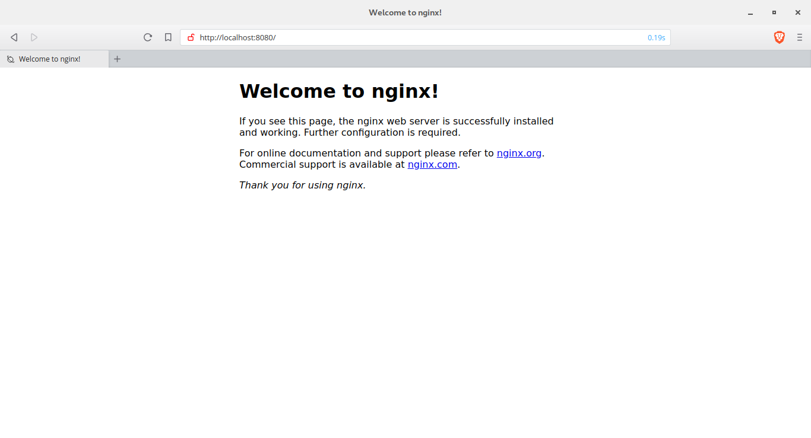

If you see the Nginx welcome screen congratulations!  You are up and running with your first container.

#### Stopping Containers

It is easy to forget which containers are running on your system.  To check, use the following command:

```shell
docker ps
```

You will get an output similar to the following:

```shell
CONTAINER ID        IMAGE               COMMAND                  CREATED             STATUS              PORTS                  NAMES
c147e0b0386f        nginx               "nginx -g 'daemon of…"   14 minutes ago      Up 14 minutes       0.0.0.0:8080->80/tcp   thirsty_pasteur
```

There is quite a bit of information here, but what we are interested in is the `CONTAINER ID` (`c147e0b0386f`) and the `NAMES` (`thirsty_pasteur`).  Either of these identifiers we can use to stop the container.  We do so with the `stop` command:

```shell
docker stop c147e0b0386f
```

Executing `docker ps` again will now provide empty output:

```shell
CONTAINER ID        IMAGE               COMMAND                  CREATED             STATUS              PORTS
```

And you can test that the web server is stopped by going to `localhost:8080` although you might have to hit refresh to ensure the cached version is not used.

#### Removing Containers

Although the container has stopped it has not been removed from your system.  To list containers on the local system run `ps` with the `-a` flag:

```shell
docker ps -a
```

You will get output similar to the following:

```shell
CONTAINER ID        IMAGE               COMMAND                  CREATED             STATUS                      PORTS               NAMES
c147e0b0386f        nginx               "nginx -g 'daemon of…"   28 minutes ago      Exited (0) 2 seconds ago                        thirsty_pasteur
08b4881360f1        nginx               "nginx -g 'daemon of…"   28 minutes ago      Exited (0) 28 minutes ago                       hopeful_johnson
ce91ec7aa627        hello-world         "/hello"                 38 minutes ago      Exited (0) 38 minutes ago                       modest_mestorf
```

These are the three containers we have started so far: two `nginx` (one detached, one not) and `hello-world`.  To remove a container we use the `rm` command:

```shell
docker rm modest_mestorf
```

If you want a container to be automatically removed when stopped, we can use the `--rm` flag when starting a container:

```shell
docker run -d --rm -p 8080:80 nginx
```

When `stop` is called on this container it will be automatically removed from the local system.

#### Docker Commands Covered

Below are the Docker commands we have covered so far.

| Docker Command | Description |
| ----- | ----- |
| `docker pull <name>` | *Pulls the named Docker image from the server to the local repository allowing it to be instantiated.* |
| `docker run <name>` | *Starts running an instance of the image `name` as a container.* |
| `docker run -d <name>` | *Starts running an instance of the image `name` as a detached container.* |
| `docker run -d -p <local>:<container> <name>` | *Starts a container, mapping the local port `local` to the container port `container`*. |
| `docker run -d --rm <name>` | *Starts running an instance of `name` which will be automatically removed when the container is stopped.* |
| `docker ps` | *Lists running containers.* |
| `docker ps -a` | *Lists all containers.* |
| `docker stop <id>` | *Stops the container with the given `id` which is the `CONTAINER ID` or `NAME`.*|
| `docker rm <id>` | *Removes a container from the local system.* |

### Writing Dockerfiles

Our aim with Docker is to run our applications within containers.  To do this, we need to create our own Docker images, which we do by writing a **Dockerfile**.  A Dockerfile specifies the set-up for a image which we can create containers from, and the syntax is simple.  Writing Dockerfiles falls into *infrastructure as code* since we can define our execution infrastructure in code files (Dockerfiles).

To start, create a new folder called `test-dockerfile` in the file-system and open the terminal (Powershell, command prompt) in that folder.  Now create a file called `Dockerfile` and use the following:

```docker
FROM ubuntu:latest
CMD ["echo", "'It worked!'"]
```

We have defined two items for our Docker image:

1. It uses the latest Ubuntu image as its parent (base).  This is the `FROM` statement.
2. It executes `echo 'It worked!'` whenever the container is started.  This is the `CMD` statement.

To build our image we use the following (from the directory that `Dockerfile` is saved):

```shell
docker build -t test-dockerfile .
```

The command tells docker to *build* an image (`build`), with the name `test-dockerfile` (`-t` means we are providing a name), and to use the current directory (`.`).  So the command format is:

```shell
docker build -t <name> <folder>
```

When executed you will get the following output:

```shell
Sending build context to Docker daemon  2.048kB
Step 1/2 : FROM ubuntu:latest
latest: Pulling from library/ubuntu
6b98dfc16071: Pull complete
4001a1209541: Pull complete
6319fc68c576: Pull complete
b24603670dc3: Pull complete
97f170c87c6f: Pull complete
Digest: sha256:5f4bdc3467537cbbe563e80db2c3ec95d548a9145d64453b06939c4592d67b6d
Status: Downloaded newer image for ubuntu:latest
 ---> 113a43faa138
Step 2/2 : CMD ["echo", "It worked!"]
 ---> Running in 3fcfdc028360
Removing intermediate container 3fcfdc028360
 ---> 4482338d49b4
Successfully built 4482338d49b4
Successfully tagged test-dockerfile:latest
```

OK, let us run an instance of our image.

```shell
docker run --rm test-dockerfile
```

And you should have the received the following output:

```shell
It worked!
```

If so, congratulations!  You have created and run your first personal Docker image.  We will look at further Dockerfile commands as we need them.  Let us get back to IntelliJ.

## Docker in IntelliJ

Thankfully, there is a Docker plug-in for IntelliJ.  To install, in IntelliJ, select **File** then **Settings**, and select **Plugins** on the right-hand side:

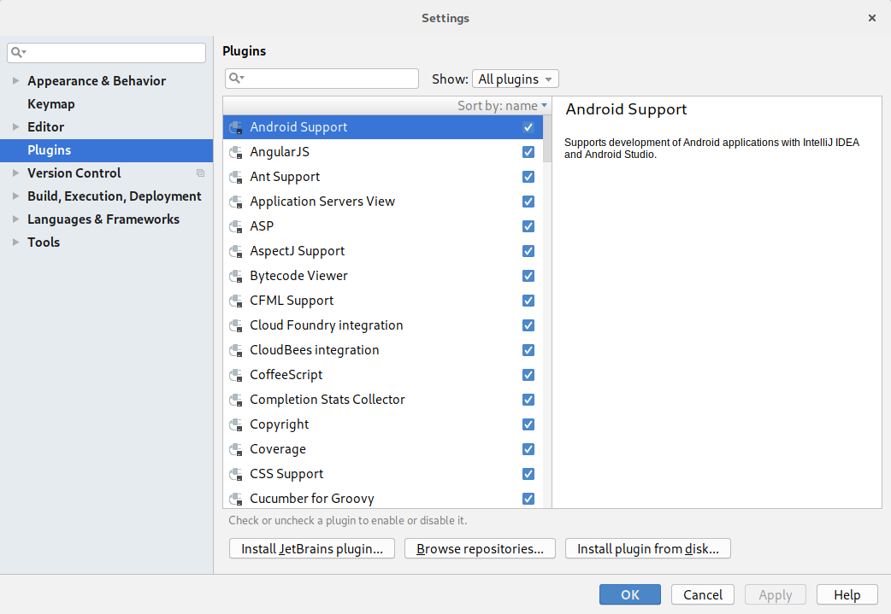

Click the **Install Jetbrains plugin...** button to open the following window:

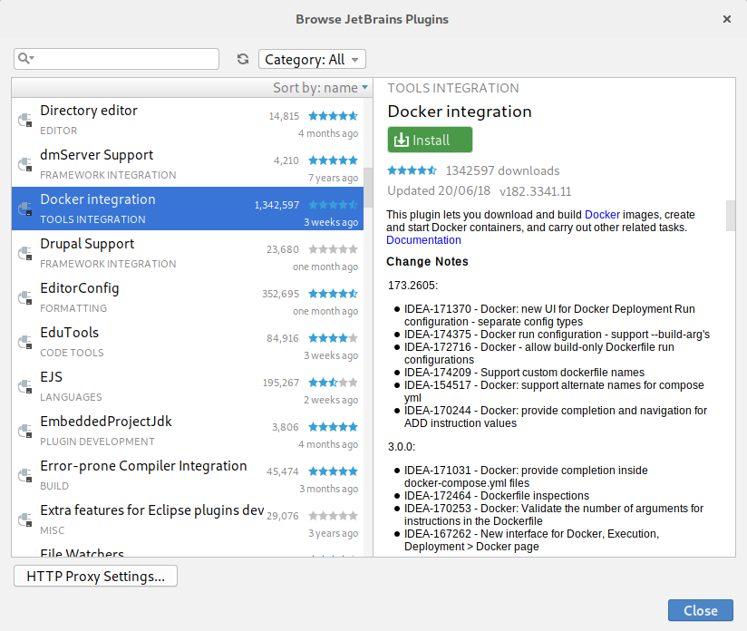

Find **Docker Integration** (as shown) and click **Install**.  The plug-in will install, and when done a **Restart IntelliJ** button will appear.  Click on it to return to the Settings window, and click **OK**.  IntelliJ will prompt for a restart, so click **Restart**.

Once IntelliJ has restarted we are ready to complete the Docker integration.  Select **File** then **Settings**.  Under **Build, Execution, Deployment**, find the **Docker** section:


**On Windows, right-click the Docker deamon in the activity icon area of Windows, and goto settings. Then turn on the Expose daemon on tcp://localhost:2375 without TLS option.**  **Click** the **+** near the top of the window, and Docker should be detected.  You will know when as the message **Connection successful** will appear as below.  When it does click on **OK**.  

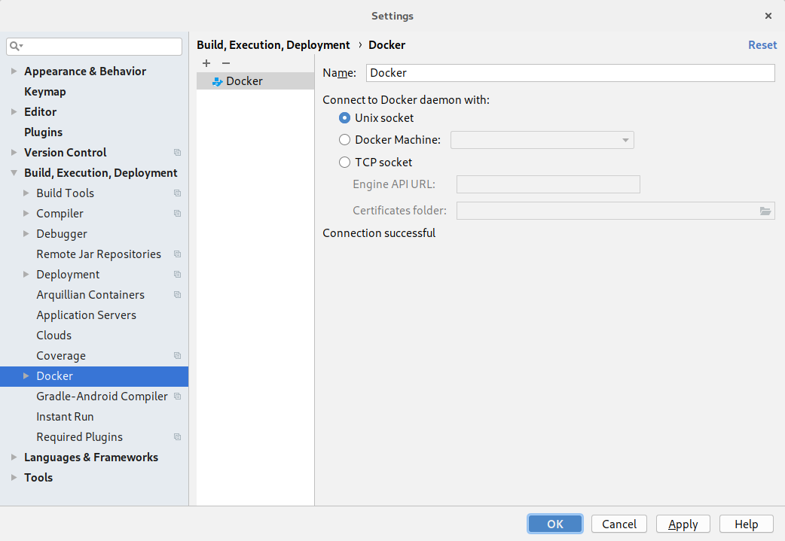

IntelliJ should open the Docker panel at the bottom of the window:

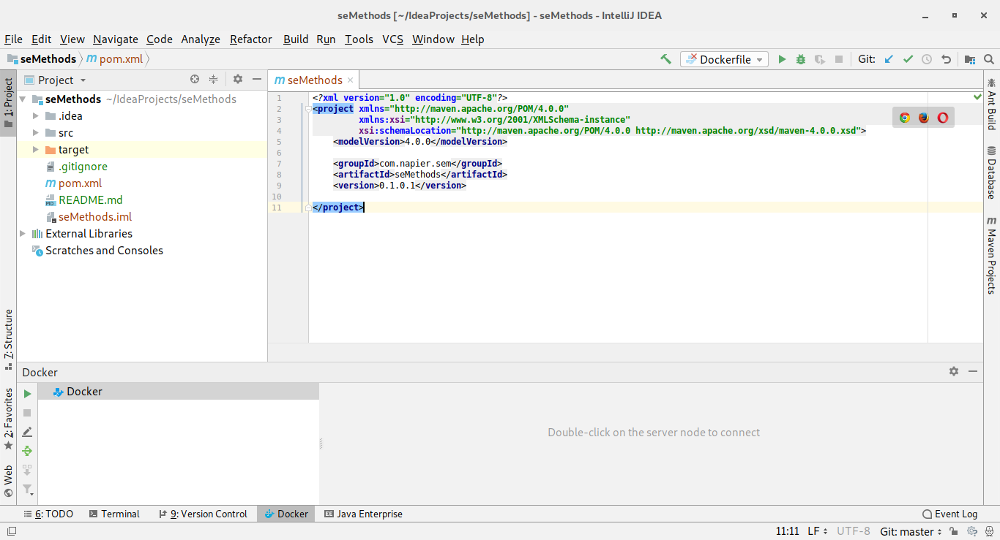

## Deploying Our Application to Docker in IntelliJ

We are almost there.  It has been a long process to get to this stage, and it may seem we have not done any software development, which we haven't.  We have setup many processes which means our software development task will be easier.  Trust me!  The process might have been long in this first lab but we have made our lives substantially easier in the future.  Let us finish our process by deploying our application to a Docker image and running it.

To finish our process we need to create a Dockerfile in IntelliJ.  **Right-click** on the project **devops** and select **New** then **File** to open the **New File** window:


Call the file **Dockerfile** and click **OK**.  Select **Yes** to add it to the Git repository.  The contents of the file are as follows:

```docker
FROM openjdk:latest
COPY ./target/classes/com /tmp/com
WORKDIR /tmp
ENTRYPOINT ["java", "com.napier.devops.App"]
```

We are using three new directives here:

1. `COPY` will copy a file or folder from the source on the local machine to the destination in the Docker image.  Here we are copying the folder `com` from `target/classes` in the project to the folder `/tmp/com`.  The source is where IntelliJ has been building our classes.  The destination is the `/tmp` folder in the image.
2. `WORKDIR` states where we want Docker to execute programs from in the container - the *working directory*.  This is `/tmp` - the same location we copied our classes to.
3. `ENTRYPOINT` tells Docker what to execute when the container is created.  That is, run `java` with the class `com.napier.devops.App`.

OK, moment of truth.  On the side of the Dockerfile code you will see two green play buttons that look like run symbols.  This is the easiest way to test our Dockerfile.  


**Click** the **triangles** and select **Run on Docker**.  The image should be built and your Docker containers and images will be updated:

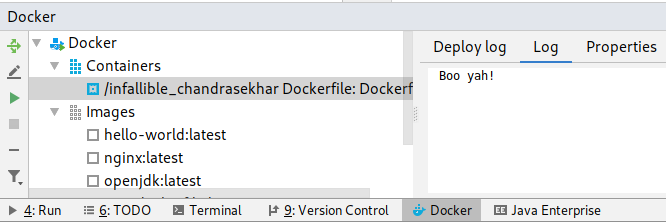

Now add the Dockerfile to our Git repository and push to GitHub:

1. Add files to the commit.
2. Create the commit.
3. Push the commit.

And you are done.  A lot of work just to print out a single string but we are in a good position to carry on in the next lab.  And just one final check for those of you who are interested.  Our created image exists in our local repository.  You can check this by using the `docker images` command:

```shell
docker images
```

You will get an output as follows:

```shell
REPOSITORY          TAG                 IMAGE ID            CREATED             SIZE
<none>              <none>              970c2949b6fc        5 minutes ago       624MB
test-dockerfile     latest              4482338d49b4        3 hours ago         81.1MB
hello-world         latest              2cb0d9787c4d        2 days ago          1.85kB
nginx               latest              3c5a05123222        7 days ago          109MB
openjdk             latest              fe9f7b1e4fa0        10 days ago         624MB
ubuntu              latest              113a43faa138        5 weeks ago         81.1MB
```

The top image is the one IntelliJ just created.  We can create a new instance by using the `IMAGE ID`.  For example, if I run:

```shell
docker run --rm 970c2949b6fc
```

I get the output:

```shell
Boo yah!
```

##### We can share this image on Dockerhub (or via private Docker repositories) so others can run our application easily.
