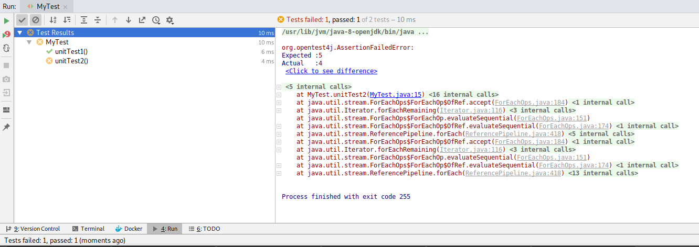
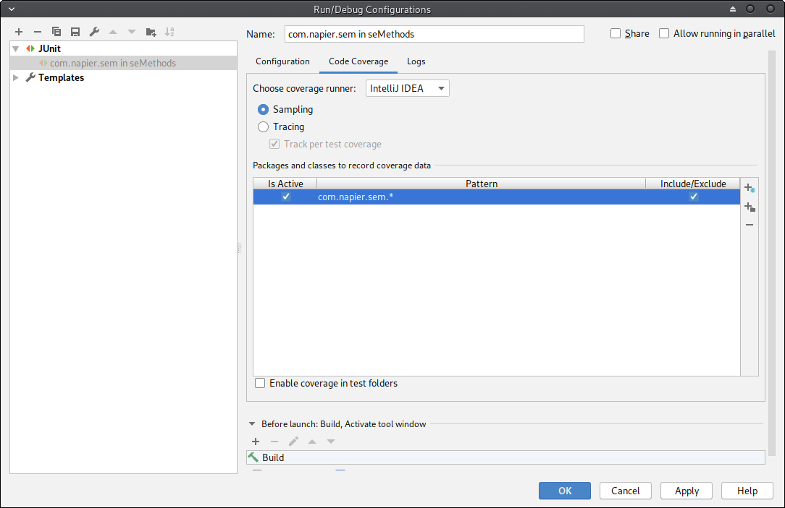
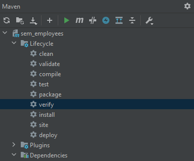
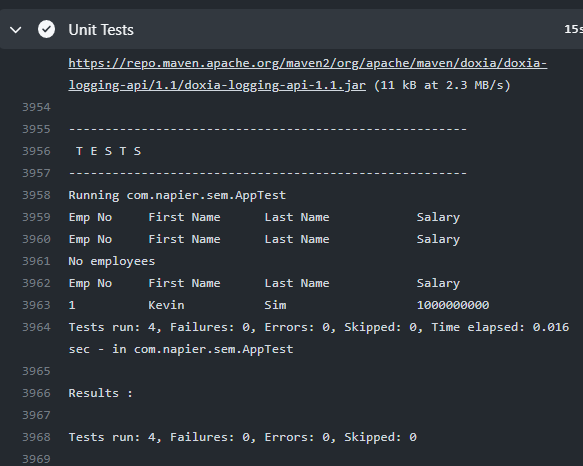
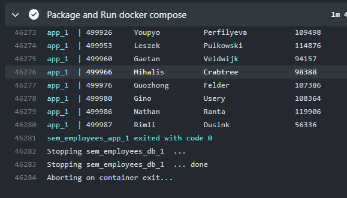

# Lab 06: Unit Testing

In this lab we will add automated testing to our method.  Unit Testing is a technique for testing individual *units* of code.  A unit is a piece of functionality - normally an individual pathway through a method.  We can write code that will test this branch of the application, and thus automate our testing process.  This will give us confidence in our code as we continue to develop it.

## Behavioural Objectives

- [ ] **Describe** a *unit test.*
- [ ] **Create** *unit tests*.
- [ ] **Execute** *unit tests in IntelliJ.*
- [ ] **Use code coverage** to *visualise code tested.*

## What is Unit Testing?

[Wikipedia](https://en.wikipedia.org/wiki/Unit_testing) defines unit testing as (emphasis mine):

> In computer programming, unit testing is a **software testing method** by which **individual units of source code, sets of one or more computer program modules** together with associated control data, usage procedures, and operating procedures, **are tested to determine whether they are fit for use**.

Also from Wikipedia:

> Intuitively, one can view a unit as **the smallest testable part of an application**.

From these statements, we can define unit testing as:

- a *software testing method*.
- testing the *smallest part of an application*.
- to determine *fitness for use*.

Let us look at an example:

```java
public int method(String str)
{
    if (str != null)
        return str.length();
    else
        return -1;
}
```

Here we have two pathways through our code: the two branches of the `if` statement.  A unit test would test one of these branches to see if it works correctly.  That means we need at least two unit tests:

1. When `str` is not `null`.
2. When `str` is `null`.

An example unit test here could be:

```java
@Test
public void testMethod1()
{
    assertEqual(5, method("Hello"));
}
```

The unit test is checking if `method` will return `5` when `Hello` is provided as an input.  The `assertEquals` means that if `method` does not return `5` then the test will fail.

Unit testing is now a **fundamental** part of software development and you should start using it as common practice from now on.  There are unit testing frameworks for most languages.  We will cover how to get started with Maven an IntelliJ in this lab.  There is plenty of material online on other approaches in other languages.

## Getting Started with Unit Testing in Maven and IntelliJ

Maven and IntelliJ both support unit testing as part of their workflows.  This means we can add the configuration for unit testing to our Maven file and IntelliJ will automatically understand what is happening.  It also allows us to run our unit tests via GitHub Actions later.

### Maven Configuration Code for JUnit

For this lab we will just work in the `develop` branch.  Check out the project as normal and switch to the `develop` branch.

As SQL, we need to add a `dependency` to our Maven project to support unit testing via the JUnit framework.  The following should be **added to the `dependencies` section of the project's `pom.xml` file**:

```xml
<dependency>
    <groupId>org.junit.jupiter</groupId>
    <artifactId>junit-jupiter-api</artifactId>
    <version>5.1.0</version>
    <scope>test</scope>
</dependency>
```

For reference, your `dependencies` section should look as follows:

```xml
<dependencies>
     <dependency>
        <groupId>mysql</groupId>
        <artifactId>mysql-connector-java</artifactId>
        <version>8.0.33</version>
    </dependency>

    <dependency>
        <groupId>org.junit.jupiter</groupId>
        <artifactId>junit-jupiter-api</artifactId>
        <version>5.1.0</version>
        <scope>test</scope>
    </dependency>
</dependencies>
```

We also need to add plugin's so Maven can run our unit tests correctly.  **Add the following to the `plugins` section**:

```xml
<plugin>
    <groupId>org.apache.maven.plugins</groupId>
    <artifactId>maven-surefire-plugin</artifactId>
    <version>2.19.1</version>
    <dependencies>
        <dependency>
            <groupId>org.junit.platform</groupId>
            <artifactId>junit-platform-surefire-provider</artifactId>
            <version>1.1.0</version>
        </dependency>
        <dependency>
            <groupId>org.junit.jupiter</groupId>
            <artifactId>junit-jupiter-engine</artifactId>
            <version>5.1.0</version>
        </dependency>
    </dependencies>
</plugin>
```

Save the file and IntelliJ should automatically pull the necessary files to support JUnit.

### Our First Unit Test

We are now ready to write our first unit test.  In Java, it is traditional and considered good practice to store test classes in a separate directory.  Let us do this now:

1. **Add a new folder - `test` - to the `src` folder of the project**.
2. **Add a new folder - `java` - to the `test` folder**.
3. **Add a new file - `MyTest.java` - to the new `java` folder**.
4. **Add the following code to `MyTest.java`**:

```java
import org.junit.jupiter.api.*;
import static org.junit.jupiter.api.Assertions.*;


class MyTest
{
    @Test
    void unitTest()
    {
        assertEquals(5, 5);
    }
}
```

There are three pieces of code you might be unfamiliar with:

- `import static` allows us to import the `static` methods of a class; `Assertions` in this case.
- `@Test` denotes that a method is a test method.
- `assertEquals` is a `static` method from `Assertions`.  It is a check to see if two values are equal.  If they are not the test will fail.

### Running the Tests via Maven

To run the test using Maven, **open the Maven view on the right** and select the **test lifecycle stage**.  Maven should build your code and run the tests, providing the following output:

```shell
-------------------------------------------------------
 T E S T S
-------------------------------------------------------
Running MyTest
Tests run: 1, Failures: 0, Errors: 0, Skipped: 0, Time elapsed: 0.008 sec - in MyTest

Results :

Tests run: 1, Failures: 0, Errors: 0, Skipped: 0
```

So our test had 0 failures and 0 errors, so it passed.

### Adding a JUnit Configuration to IntelliJ Build

Having Maven run our tests is important when we combine our tests into our continuous integration process.  However, a textual response is not as easy to read.  IntelliJ can provide us with better visual feedback.  First though we need to tell IntelliJ how to run our tests.

First, we need to tell IntelliJ where our tests are.  This is done via the **Project Structure Dialogue**.  **Select File then Project Structure**.  This will open the following window:


**Select the `src/test/java` folder** and **click the Tests button at the top of the structure view.**  This tells IntelliJ that our tests are in this folder.  **Click OK** to exit.

Now we need to add a **Run/Debug Configuration**.  **Select Run then Edit Configurations** to open the new view:


Modify the dialogue to match.  That is:

- Use the JUnit template on the left.
- Select `devops` as the classpath of module.
- Use `MyTest` as the Class.

**Click OK** and IntelliJ is now ready to run the tests.

### Running Tests

To run the tests you should just be able to **click the green run button**.  If not, ensure that the new build configuration is selected as the run target and try again.  Once completed, you should get the following output:


The green tick means the test passed.  Now let us see what happens when a test fails.  Add the following code to `MyTest`:

```java
@Test
void unitTest2()
{
    assertEquals(5, 4);
}
```

Run the tests again and this time you will get the following:

`unitTest2` has failed, and on the right we see why:

```shell
Expected :5
Actual   :4
```



Notice also the failing test is red underlined in the code.

### Other Test Examples

Add the following to `MyTest`.  They illustrate some other test types:

```java
@Test
void unitTest3()
{
    assertEquals(5, 5, "Messages are equal");
}

@Test
void unitTest4()
{
    assertEquals(5.0, 5.01, 0.02);
}

@Test
void unitTest5()
{
    int[] a = {1, 2, 3};
    int[] b = {1, 2, 3};
    assertArrayEquals(a, b);
}

@Test
void unitTest6()
{
    assertTrue(5 == 5);
}

@Test
void unitTest7()
{
    assertFalse(5 == 4);
}

@Test
void unitTest8()
{
    assertNull(null);
}

@Test
void unitTest9()
{
    assertNotNull("Hello");
}

@Test
void unitTest10()
{
    assertThrows(NullPointerException.class, this::throwsException);
}

void throwsException() throws NullPointerException
{
    throw new NullPointerException();
}
```

- `unitTest3` illustrates how we can add a message to a test.
- `unitTest4` illustrates how to test floating point values with an error range.
- `unitTest5` illustrates how to compare array contents in a test.
- `unitTest6` illustrates how to test if a value is `true`.
- `unitTest7` illustrates how to test if a value is `false`.
- `unitTest8` illustrates how to test if a value is `null`.
- `unitTest9` illustrates how to test if a value is not `null`.
- `unitTest10` illustrates how to test if a method throws an exception.  By default, any exception thrown fails a test if no `assertThrows` matches.

## Adding Tests to the HR System: Printing Salaries

Let us add unit tests to our HR System.  We will only add tests for printing salaries now.  We will add more tests as we progress.

### Inputs to Printing Salaries

A good technique for defining unit tests is to think about the possible values that can be provided as parameters.  `printSalaries` takes an `ArrayList<Employee>` as a parameter.  There are four possible values that can be provided:

- `null`.
- an empty list.
- a list with `null` member in it.
- a list with all non-null members (a normal list).

We will create these four tests, updating our `printSalaries` code as required.

### Unit Tests for Printing Salaries

First, **delete the existing test file**.  We don't want it confusing the test results.  Then **add a new package to `src/test/java` called `com.napier.devops`**.  Finally, we need to update our test configuration.  Change it to the following, where we run all tests in a package:


#### Employees is `null`

First we will add the test to check what happens when we pass `null` to `printSalaries`.  We don't want any error to occur, so really we just want to call the method.  The test code is:

```java
package com.napier.devops;

import org.junit.jupiter.api.BeforeAll;
import org.junit.jupiter.api.Test;
import org.junit.jupiter.api.TestInstance;

import java.util.ArrayList;

import static org.junit.jupiter.api.Assertions.*;

public class AppTest
{
    static App app;

    @BeforeAll
    static void init()
    {
        app = new App();
    }

    @Test
    void printSalariesTestNull()
    {
        app.printSalaries(null);
    }
}
```

The method `init` is called `@BeforeAll` the tests are run.  It allows us to do some initial construction work to manage the tests.  Here, we are creating an instance of `App` to work with.  The `@Test` method will then call `printSalaries` with `null`.

When you run the test, it will fail.  This is because a `NullPointerException` is thrown.  We can fix that by updating `printSalaries` to check if `employees` is null:

```java
public void printSalaries(ArrayList<Employee> employees)
{
    // Check employees is not null
    if (employees == null)
    {
        System.out.println("No employees");
        return;
    }
    // Print header
    System.out.println(String.format("%-10s %-15s %-20s %-8s", "Emp No", "First Name", "Last Name", "Salary"));
    // Loop over all employees in the list
    for (Employee emp : employees)
    {
        String emp_string =
                String.format("%-10s %-15s %-20s %-8s",
                        emp.emp_no, emp.first_name, emp.last_name, emp.salary);
        System.out.println(emp_string);
    }
}
```

Run the test now and it will pass.

#### Employees is Empty

Let us test what happens when `employees` is empty:

```java
@Test
void printSalariesTestEmpty()
{
    ArrayList<Employee> employess = new ArrayList<Employee>();
    app.printSalaries(employess);
}
```

This test will pass, so let us move on.

#### Employees Contains `null`

Our next test will try and print a list with a `null` value in it:

```java
@Test
void printSalariesTestContainsNull()
{
    ArrayList<Employee> employess = new ArrayList<Employee>();
    employess.add(null);
    app.printSalaries(employess);
}
```

Running this test also fails.  We need to update `printSalaries` to check if an `Employee` is `null`:

```java
public void printSalaries(ArrayList<Employee> employees)
{
    // Check employees is not null
    if (employees == null)
    {
        System.out.println("No employees");
        return;
    }
    // Print header
    System.out.println(String.format("%-10s %-15s %-20s %-8s", "Emp No", "First Name", "Last Name", "Salary"));
    // Loop over all employees in the list
    for (Employee emp : employees)
    {
        if (emp == null)
            continue;
        String emp_string =
                String.format("%-10s %-15s %-20s %-8s",
                        emp.emp_no, emp.first_name, emp.last_name, emp.salary);
        System.out.println(emp_string);
    }
}
```

Run the tests again and it will pass.

#### Employee Contains All Non-`null`

Our final test is for normal conditions.  The test code is:

```java
@Test
void printSalaries()
{
    ArrayList<Employee> employees = new ArrayList<Employee>();
    Employee emp = new Employee();
    emp.emp_no = 1;
    emp.first_name = "Kevin";
    emp.last_name = "Chalmers";
    emp.title = "Engineer";
    emp.salary = 55000;
    employees.add(emp);
    app.printSalaries(employees);
}
```

This test will also pass.

## Code Coverage

To end our examination of unit testing we will look at **Code Coverage**.  Coverage allows us to examine how much of our code is tested.

To enable code coverage, select **Run then Edit Configurations**.  Open the **Code Coverage** tab and ensure it looks the same as this:



**Click OK** to close the window.  Then **select Run and Run with Coverage.**  This will open the **Code Coverage View** on the right:


It details the percentage of classes, methods and lines covered by tests.  **Double-click `com.napier.devops`** to open a per-class view:


As you can see, it is the `App` class that needs the most work.  We can actually see the lines covered and not covered by tests in the source file:


Lines with red next to them (e.g., lines 196 to 201) are not tested.  Lines with green next to them (e.g., lines 230 to 235) are tested.  This allows us to ensure **all** our code is tested.

## Exercise: Add Unit Tests for Display Employee

Now add unit tests for the `displayEmployee` method.  Follow the same pattern:

- Define the possible inputs for the method.
- Write a test for each input.
- Update `displayEmployee` until all tests pass.

## Next Feature: Department Manager Printing Salaries

Our next feature is:

3. As an *department manager* I want *to produce a report on the salary of employees in my department* so that *I can support financial reporting for my department.*

We have already implemented this feature, so move it to done in your Zube board.

## Update GitHub Actions for Unit Tests

We can separate the Unit Tests from our application in GitHub Actions.

Change your workflow main.yml to the following

```yml
name: A workflow for my Hello World App
on: push

jobs:
  build:
    name: Hello world action
    runs-on: ubuntu-20.04
    steps:
      - name: Checkout
        uses: actions/checkout@v4
        with:
          submodules: recursive
      - name: Set up JDK 11
        uses: actions/setup-java@v2
        with:
          java-version: '11'
          distribution: 'adopt'
      - name: Unit Tests
        run: mvn -Dtest=com.napier.devops.AppTest test
      - name: Package and Run docker compose
        run: |
          mvn package -DskipTests
          docker compose up --abort-on-container-exit


```

There are a few things to note here.

We have added a stage called Unit Tests that runs a **specific** Test Class using the parameter 

`-Dtest=com.napier.devops.AppTest` to specify the test class

We have combined stages into a new stage called *Package and Run docker compose* that uses multiple run commands (The pipe **|** following the run: declaration allows multiple lines to follow)

There are two commands:

 ```run: |
          mvn package -DskipTests
          docker compose up --abort-on-container-exit
 ```
 The first command packages our jar without running the Unit Tests (In maven all commands above a stage are executed so mvn package runs clean, validate compile and test before packaging)



The second command runs our docker-compose file which requires the packaged jar with dependencies.

## Cleanup

Now clean-up as normal, ensuring you commit everything to GitHub, checking the our new GitHub Actions are successful. If they are you should see output similar to the following.

### Unit Tests


### Package and docker-compose


