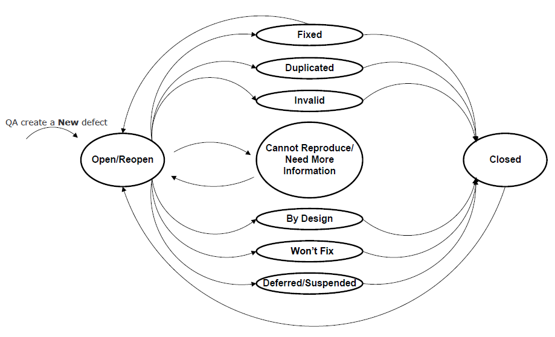

# Unit 9b: Bug Tracking and Software Monitoring

This Section is split into two related subsections. Bug Tracking and Software Monitoring.

# Bug Tracking 

The first subsection defines bug tracking, the act of finding, reporting, and monitoring software defects.  We take a generic look at the topic, as bug fixing and debugging is language specific.  Our aim is to examine how bug tracking fits into our workflow and method.

## Behavioural Objectives

- [ ] **Define** *software bugs, smells, and technical debt.*
- [ ] **Describe** *a bug tracking system.*
- [ ] **Describe** *bug tracking lifecycle.*
- [ ] **Evaluate** *good bug reporting practice.*

## Bugs, Smells, and Technical Debt

First, let us define the term bug. From Wikipedia:

> A software bug is an error, flaw, failure or fault in a computer program or system that causes it to produce an incorrect or unexpected result, or to behave in unintended ways.

A bug is something amiss with our program. We have to correct bugs, but, first, we need to determine what is amiss.

A similar term is a code smell. From Wikipedia:

> In programming, a code smell is a characteristic in the code that shows a deeper problem.

Poor implementation contributes to code smell which leads to separate issues. A smell arises from indifferent or rushed programmers not complying to quality demands.

Bugs and smells form part of technical debt. We must devote time paying off our technical debt. If technical debt builds interest, it can bring significant, longer-term complications.

## Bug Tracking systems

Remember our focus is developing processes and methods. For example, GitHub is more than version control. GitHub is a software configuration management system.

Bug finding is a craft, driven via code reviews, testing, users, and luck. We examine bug reporting later in this unit. Once a user or QA report a bug, we need to manage or track it.

From Wikipedia:

> A bug tracking system or defect tracking system is a software application that keeps track of reported software bugs in software development projects.

This definition does not inform us - a bug tracking system is a program that tracks bugs.

A bug tracking system is a database recording data on bugs. We define what bug data to store later in the unit. Another crucial part of the system is managing a bug's lifecycle. We examine bug state later in the unit.

A bug tracking system should integrate into our project management workflow. We track bugs as issues, and therefore they show on our Kanban/Sprint board.

Bug tracking systems are issue tracking systems. From Wikipedia:

> An issue tracking system (also ITS, trouble ticket system, support ticket, request management or incident ticket system) is a computer software package that manages and maintains lists of issues.

Again, Wikipedia is unclear. A bug tracking system functions with bugs and an issue tracking system functions with issues. Issues are general. For example, feature requests can be issues. A bug is a defect we need to resolve.

Developers used spreadsheets for bug tracking, but caused:

- Lack of communication: hard to discuss the bug.
- Lack of visibility: bug discussion is via emails not seen by the full team.
- Lack of real-time updates: no notifications on bug progress or new bugs.
- Lack of fluid properties: challenging to manage bug priority.
- Lack of a central repository: no one location to store description, screenshots, progress and feedback.
- Lack of insights: difficult to see patterns and trends.
- Lack of integration with other work: bug tracking exists separate to the rest of our work, which goes against the single repository of truth paradigm.

A spreadsheet of bugs is limiting. Bugzilla is a full bug tracking system. It provides a database, lifecycle management and notifications. These features are useful, but we lack integration with our repository.

A better solution is GitHub issues. Alternatively, we can adopt a tool that uses GitHub issues. Zube is such a tool, albeit designed for Kanban/Sprint planning.

Jira is more sophisticated, integrating with GitHub issues and providing both Kanban and bug tracking features.

## Bug Tracking Workflow

Let us now consider a bug tracking workflow. There are four stages of bug tracking:

- Capturing: where QA or users discover bugs.
- Prioritising: where the team sort the bugs into a work order.
- Tracking: where the team fix bugs and update their status.
- Releasing: where customers receive bug fixes.

The basic lifecycle of a bug is:

A bug's lifecycle stages are:

- open/reopen: when someone reports the bug, or QA marks the bug as not fixed.
- in progress: when development work on fixing the bug.
- resolved: when development submits the fix and is awaiting a QA review.
- closed: when QA make sure the bug fix passes inspection.

Another bug lifecycle is:

A bug is either accepted or rejected. If accepted, development and QA fix and test the solution.

A more detailed bug state is:

These states are labels for a bug. The state is more informative to QA and other stakeholders. For example, the defect is a design choice or one that the team won't fix.

On GitHub, bugs are issues. We can set a template for reporting. We can use labels to mark the state of a defect. Combining these features with GitHub's project board or Zube's Kanban/Sprint board provides a complete bug management system.

So, bug tracking via our backlog is possible. Ticket systems do this. A good practice is tracking bugs via our backlog and board to support a good workflow:

- We can check for duplicate bugs in the backlog.
- We create a new defect as a card in the backlog.
- We can prioritise and assign bugs.
- When we fix the bug, it moves to the done column.

## Bug Tracking Best Practices

The best practices of bug tracking are:

- Be thorough. The more information presented on the bug, its cause, and its fix, the better for the team.
- Make sure a bug is valid.
- Make sure we have complete information on the bug; e.g., title, description, screenshots, etc. 
- Make sure people only report bugs once.
- Make sure people give details to reproduce a bug.
- Think through the bug.
- Always look for new bugs: no program is bug-free.

A key aspect of bug tracking is bug communication. Any good bug report should have:

- Steps required to reproduce the bug.
- What was the expected result?
- What was the actual result?

These key elements help the development team to find and fix the bug.  Withholding part of this information means the team lacks the knowledge of the defect and thus cannot find or fix it.

## Bug Communication

To communicate a bug, we must provide a good description. A good description includes:

- A description of what happens. What is the observed defect?
- A description of when it happens. What are the causes of the defect?
- If the defect always occurs. Is the bug intermittent?
- A description of how the bug occurs at present. Maybe the circumstances under which the bug occurs have changed.
- What are the steps required to reproduce the bug?

Bug reporting is an integral ingredient of our software maintenance task. There are two types of bug reporting:

- QA and other members of the team undertake internal bug reporting.
- Users’ of the software undertake external bug reporting.

Our bug tracking process must support both types of reporting. We give templates to capture information.

## Bug Reporting

Good bug reporting practice is essential. To illustrate poor communication, I will use examples from teaching. These examples are universal.  If you’ve written in this fashion before, don’t worry.  Others have sent emails like this before.  From now, improve your delivery of issues.

### Be Specific

"I ran the code, and it’s not working." If you communicate this, you haven’t told the teaching team much. First, what do you mean you ran the code? What does running the code mean? In this module, it could mean:

- You selected run within IntelliJ. 
- You ran the Docker container for the application. 
- You pushed your container to Google Cloud.

Saying you ran the code tells us little.  Be specific. No one else lives in your head. Without the specific information you have, we cannot help you fix the bug.

### Be Verbose

"Lab 2 doesn’t work." OK, why does lab 2 not work? "The program doesn’t run." OK, what part of the lab are you doing? "The part with Docker." And so on.

Be verbose. Offer as much information as you can in a bug report. It is easy for the developer to ignore irrelevant information. Solving a lack of information can only happen by asking more questions. No one else has the knowledge you have. Thus share as much information as you can.

### Watch Your Pronouns

"It doesn’t work." What is "it"? Be careful with pronouns and related words (e.g., it, he, she, they, this, etc.).

### Inform What Else You've Done

"I cannot connect to the database container." OK, after digging around we are unsure why. "Oh, I installed MySQL on my machine. Is that a problem?" Yes. We find quicker solutions with improved information.  State what configurations you have used, or any extra steps you’ve tried to solve the problem. This information is vital to reduce time wasted trying to resolve the issue.

### Don't Use Anecdotal Evidence or Perform Confirmation Bias

"Lab 7 isn’t working, and everyone I’ve spoken to says they have the same problem." Give the developer credit.  They either know the problem or will find it with you. Stating you know someone else with a problem doesn’t help:

- The other person may have a different problem.
- The other person may have a different configuration.
- You’ve performed confirmation bias. You don’t know who has a working system. You are trying to justify your problem. If a legitimate problem, you need not to justify it.

### Proof Read

Finally, read what you wrote. Always review and edit any text you send to others. If you rush and want it done and sent, you might not make sense, you might miss information, or you might offend. Time saved rushing disappears because development requests more information to understand the issue. Furthermore, people can become confused or upset. If submitting coursework, you will lose marks. So take your time and review what you have done.

## Summary

Bug tracking and management is a big subject, but there are few formalised texts on the process.  Most companies have their own methods.  However, some standard tools are out there.  Specifically, we have:

- Defined software bugs (defects), smells (poor implementation), and technical debt in how they relate.
- Described a bug tracking system as essentially a database which holds facts on a defect and allows bug lifecycle management.
- Described a bug tracking lifecycle, from open to fixing to closed.
- Evaluated good bug reporting practice, particularly focusing on good communication.

# Monitoring Software

The second subsection introduces ideas on monitoring our applications.  It is really an introduction to the subject area and includes recommended reading if you want to practically build large scale systems.

## Behavioural Objectives

- [ ] **Define** *information visualisation.*
- [ ] **Describe** *system monitoring.*
- [ ] **Define** the *requirements for a system monitoring framework.*
- [ ] **Define** *application monitoring approaches.*

## Information Visualisation

From [Wikipedia](https://en.wikipedia.org/wiki/Information_visualization):

> Information visualization or information visualisation is the study of (interactive) visual representations of abstract data to reinforce human cognition.

Visualisation is about the graphical representation of data in a manner that helps people understand what the data means.  It is a very large field of research, including organisations such as Google, Adobe, and IBM.  We will not go into the methods and principles of information visualisation here, but it is worth noting that our discussion on monitoring software has roots in this area.

Below is an example visualisation:

 By <a href="//commons.wikimedia.org/w/index.php?title=Barrett_Lyon&amp;action=edit&amp;redlink=1" class="new" title="Barrett Lyon (page does not exist)"> The Opte Project</a> - Originally from the <a href="https://en.wikipedia.org/wiki/Main_Page" class="extiw" title="en:Main Page">English Wikipedia</a>; description page is/was <a href="https://en.wikipedia.org/wiki/en:Image:Internet_map_1024.jpg" class="extiw" title="w:en:Image:Internet map 1024.jpg">here</a>., <a href="https://creativecommons.org/licenses/by/2.5" title="Creative Commons Attribution 2.5">CC BY 2.5</a>, <a href="https://commons.wikimedia.org/w/index.php?curid=1538544">Link</a>

This is a (partial) map of the Internet in 2005.  The lines represent two machines being connected, and the colour the length of delay between the machines connected.  The aim is to spot patterns and then investigate further.  This allows **exploration** of data.

### Software Visualisation

*Software Visualisation* is a field of information visualisation research focused on the visual representation of software data.  As we have highlighted, there is a lot of data that can be generated about our code and its runtime environment.  Below is an image that represents the Ndepend Tool's unit test code coverage.

Source: https://www.ndepend.com/docs/treemap-visualization-of-code-metrics

The visualisation uses the following techniques:

- the **size** of a square represents the *total lines of code (LoC)* for that method, class, namespace.
- the **colour** of a square represents the *percentage coverage* of unit test: green being good, red being bad.

Straight away we can spot where we might want to write more tests to improve the quality of our code.  The visualisation has presented information and we can see the patterns of interest.

Another visual representation you may be familiar with is from your Git branches.  Below is an example:

Source: https://www.tablix.org/~avian/blog/archives/2014/06/vesna_drivers_git_visualization/.

The main use of this view is during development, allowing us to trace history or support our merging work.  Again, we look for patterns to understand our information.

Finally, visualisation has been used to illustrate behaviour.  Below is an example of a quicksort algorithm working:

 By <a href="//commons.wikimedia.org/w/index.php?title=User:Simpsons_contributor&amp;action=edit&amp;redlink=1" class="new" title="User:Simpsons contributor (page does not exist)">Simpsons contributor</a> - Own work, <a href="https://creativecommons.org/licenses/by-sa/3.0" title="Creative Commons Attribution-Share Alike 3.0">CC BY-SA 3.0</a>, <a href="https://commons.wikimedia.org/w/index.php?curid=14918391">Link</a>

This visualisation can be used to help explain how something works, to see how it works, or to check it does work.

### Business Dashboard

Our aim when building monitoring tools for software is to create dashboards.

 By <a href="//commons.wikimedia.org/w/index.php?title=User:Kate07lyn&amp;action=edit&amp;redlink=1" class="new" title="User:Kate07lyn (page does not exist)">Kate07lyn</a> - Jinfonet Software, <a href="https://creativecommons.org/licenses/by-sa/3.0" title="Creative Commons Attribution-Share Alike 3.0">CC BY-SA 3.0</a>, <a href="https://commons.wikimedia.org/w/index.php?curid=13309105">Link</a>

From [Wikipedia](https://en.wikipedia.org/wiki/Dashboard_(business)):

> Dashboards often provide at-a-glance views of key performance indicators (KPIs) relevant to a particular objective or business process. In the other, "dashboard" has another name for "progress report" or "report."

Dashboards provide easy visuals for us to see important information about the organisation.  We want to see quickly how well we are meeting our targets.  This may include financial information, geographic information, or other performance indicators:

 By <a href="//commons.wikimedia.org/w/index.php?title=User:Growthlakes&amp;action=edit&amp;redlink=1" class="new" title="User:Growthlakes (page does not exist)">Growthlakes</a> - Own work, <a href="https://creativecommons.org/licenses/by-sa/4.0" title="Creative Commons Attribution-Share Alike 4.0">CC BY-SA 4.0</a>, <a href="https://commons.wikimedia.org/w/index.php?curid=60026450">Link</a>

## Monitoring Systems

System monitoring is about knowing the state of the technology environment.  We use monitoring to:

- Detect faults.
- Diagnose faults.
- Resolve faults.

Monitoring also provides data to support the business, such as:

- user experience data.
- where to make product and technology investments.

An example monitoring dashboard is below:

 By <a href="//commons.wikimedia.org/wiki/User:Raysonho" title="User:Raysonho">Raysonho @ Open Grid Scheduler / Grid Engine</a> - Own work, <a href="http://creativecommons.org/publicdomain/zero/1.0/deed.en" title="Creative Commons Zero, Public Domain Dedication">CC0</a>, <a href="https://commons.wikimedia.org/w/index.php?curid=27359495">Link</a>

Technically, monitoring is the tools and processes to measure and manage IT systems.  However, monitoring goes further than this because we translate the metrics into business value.  This comes from measuring the user experience.  The better the user experience, the more people will use your system.  We also gain data on how people use the system, thus supporting investment and decision making.  It also supports the operations team in delivery quality of service.  Therefore, any monitoring system has two customers:

- the business.
- the IT (operations) team.

Monitoring is important.  It is often considered an add-on, much like security.  **Do not see monitoring as an add-on.**  It is a core function to your work as a software engineer.  You need to know how your software is working.  **You are an engineer - not a cowboy.**  So monitoring should be in your user stories, and in all your software components.

**Not adding monitoring creates operational risk.**  This results in (taken from *The Art of Monitoring*):

- An inability to identify or diagnose faults.
- An inability to measure the operational performance of your application.
- An inability to measure the business performance and success of an application or a component, like tracking sales figures or the value of transactions.

Also, we need to recognise that over-instrumentation is best.  You are more likely to complain about not having enough data rather than too much.

## Monitoring Culture

Applying monitoring in an organisation is again a cultural issue.  *The Art of Monitoring* has defined a three-level organisational maturity model of monitoring.

### Manual Monitoring or None

Monitoring is a manual process that requires a person to initiate.  It may also be the case that no monitoring is done at all.  Generally, monitoring is done via a checklist, simple script, or other non-automated processes.

The aim in manual monitoring is to manage assets and avoid downtime, and thus provides little value on user experience and quality of service.  It will not allow the development and operations teams to justify investments and new projects as there is no data to support it.

### Reactive Monitoring

Reactive monitoring automates most of the processes with some left as manual.  Tooling will have been deployed to perform the monitoring process.  However, the same aims exist - measuring availability and managing assets.  More sophisticated metrics may exist that support customer experience.

The term reactive is used as this form of monitoring is expanded in response to incidents.  The operations team are generally running the system and thus metrics are focused on their needs.

### Proactive Monitoring

Proactive monitoring supports infrastructure and the business.  It is done automatically and generated as part of configuration management.  Metrics focus on application performance and business outcomes rather than just disk and CPU usage.  Quality of service and user experience are key.  Also, the data allows the development and operations team to justify investment.

The operations team will manage monitoring, but everyone sees it as a responsibility.  The development team will build it into new products, and the definition of done will include monitoring.

## A Monitoring Framework

An example of a monitoring framework is below:

Source: *The Art of Monitoring.*

In general, we should monitor systems using push-based methods rather than pull-based.  That is, our systems should **emit** data rather than be requested for it.  The data should be emitted to a central collector for management.

An emitter reports that it is available by emitting data.  An emitter is also stateless - it just sends the data to the collector when it is generated.  If a metric is available, an event reporting, or log is spooling then the service is available.  If it stops, then the service is not available.  We then visualise these metrics, events and logs to allow the team to interpret the complex information gathered.

This change to emitting moves the focus from service availability in our monitoring system.  If IT assets are judged as capital and operational expenses then they can be cut.  Availability only provides this view.  Additional monitoring illustrates the value in investing in IT infrastructure and other projects.

Operations teams used to see hosts (servers) as pets.  They fixed and nursed their pets back to life multiple times, fiddling with settings, and investing time in their health.  Our work in Docker and now in cloud infrastructure points to a different view.  Hosts are a herd.  We automatically configure, rebuild, kill, restart and add hosts.  It is easy.  We do not see the single machine any more, but a host environment that we can spin up and shutdown as needed.  This removes a wealth of checks in our system - we just rebuild a host or component if it fails.  It also changes the view of IT assets.

Fault detection systems have traditionally only provided true/false information.  Also, the systems were developed using static ideas:

- You implement the same checks you've used in the past or from the documentation.
- You implement a check in response to an incident..

*The Art of Monitoring* highlights three approaches to monitoring applications:

- Emitting metrics by instrumenting code.
- Generating structured or semantic log events.
- Building health checks and endpoints.

We will not go into any of these in detail, but *The Art of Monitoring* walks through how to build such a system from the ground up.  If you want to build your own monitoring system you should use this book.

### Metrics and Events

*The Art of Monitoring* specifies the following types of data that can be gathered:

- Resource information, like consumption of CPU or memory 
- Performance information, like latency and application throughput 
- Business and user-experience metrics, like volumes or the amounts of transactions or numbers of failed logins 
- Log data from hosts, services, and applications

Generally, these can be divided into the following three categories:

- **Events**: changes and occurrences in our environment.
- **Logs**: a subset of events most useful for fault diagnosis and investigation.
- **Metrics**: most useful to help us understand what's going on in our environment.

Metrics are measures of software and hardware properties.  A metric involves keeping track of a state by making an observation which is a value and a timestamp, with possibly some other properties of interest.  *We are undertaking a scientific approach here.*  We gather the appropriate data to allow us to make hypothesis and judgements on system performance.

Metrics change our view from fault-detection to state, availability and performance of our system.  They provide a dynamic, real-time understanding of the application and allow us to make good decisions about its use and expansion.  Metrics may also provide data to catch faults before they occur.

### Notifications

A monitoring system must provide notifications.  These can be emails (such as Travis does), text messages, or pop-ups.  *The Art of Monitoring* defines the basics of a notification system as:

- Who to tell about a problem.
- How to tell them.
- How often to tell them.
- When to stop telling them, do something else, or escalate to someone else.

A good notification framework should:

- Make notifications actionable, clear, and articulate.
- Add context to notifications.
- Align notifications with the business needs of the service being monitored.

### Approaches to Monitoring

There are two two approaches to monitoring:

- **Blackbox** where you query a service to check properties such as availability.
- **Whitebox** where you emit data from your application.

Blackbox monitoring should be used on services and applications outside your system.  You have little to no control over such systems, and so must gather whatever data you can to ensure the health of your system.

Whitebox monitoring is the approach taken by your own system.  You emit data to the collector, providing as much instrumentation as feasible.  As a software engineer, you are more concerned with whitebox monitoring as you are writing the applications involved.

## Application Monitoring

Source: https://www.splunk.com/en_us/it-operations/application-analytics-and-monitoring.html.

When building application monitoring the first areas to work on are entry and exit points from our system (from *The Art of Monitoring*):

- Measure and log requests and responses.
- Measure and log all calls to external services and APIs.
- Measure and log job scheduling, execution, and other periodic events.
- Measure significant business and functional events.
- Measure methods and functions that read and write from databases and caches.

An endpoint is where we interface with the system (e.g., a URL listening point).  We can test availability, gather performance metrics, etc.  This can be returned in JSON data format that we can then store in our central collector.

There are two types of metrics for applications:

- **Application metrics**: the state and performance of application code.
- **Business metrics**: the value of your application (e.g., sales made).

Application metrics focus on user experience (e.g., response time), throughput (e.g., request volume), and transaction time.  Business metrics often use application metrics.  For example, payment latency increases the cost of processing payments, which is a business cost.

Commonly, a library to support monitoring is used.  An API call allows us to store our values in our central gathering point.  This provides a unified monitoring interface.  If we cannot insert code directly (e.g., external systems, blackbox systems, legacy systems), we put the monitoring as close to the measuring point as we can.

### Metric Types and Visual Approaches

Finally, we can consider the types of metrics we can gather and how to visualise them.  In simple terms, we have the following metric types:

- **Gauges** show a number that will change over time (e.g., CPU usage).  We want to see the metric at a given point in time.
- **Counters** increase over time, such as uptime and sales.  Useful for mapping rates of change.
- **Timers** are used to determine how long something took, for example a request.
- **Summaries** combine metrics into a more useful statistic.  For example, means, medians, percentages, etc.

A gauge can be a simple number or a visual metaphor such as a real gauge:

 By <a rel="nofollow" class="external text" href="https://www.flickr.com/photos/54613528@N00">leapingllamas</a> - <a rel="nofollow" class="external text" href="https://www.flickr.com/photos/54613528@N00/11897019">Flickr</a>, <a href="https://creativecommons.org/licenses/by/2.0" title="Creative Commons Attribution 2.0">CC BY 2.0</a>, <a href="https://commons.wikimedia.org/w/index.php?curid=794301">Link</a>

Other metaphors normally include bar/column charts (for discrete data) and line charts (for continuous data).

## Summary

In this unit we have examined application monitoring at a very high level.  In particular, we have:

- Defined information visualisation as the graphical representation of data in a manner that helps people understand what the data means.
- Described system monitoring, looking at what to monitor and the culture required.
- Defined the requirements for a system monitoring framework, including emitters and notifications.
-Defined application monitoring approaches, looking at what to monitor and how to present this.

## Recommended Reading

*The Art of Monitoring* by James Turnbull covers both the principles of monitoring and how to build a monitoring system.  If you want to build a monitoring feedback this is a good starting point.

